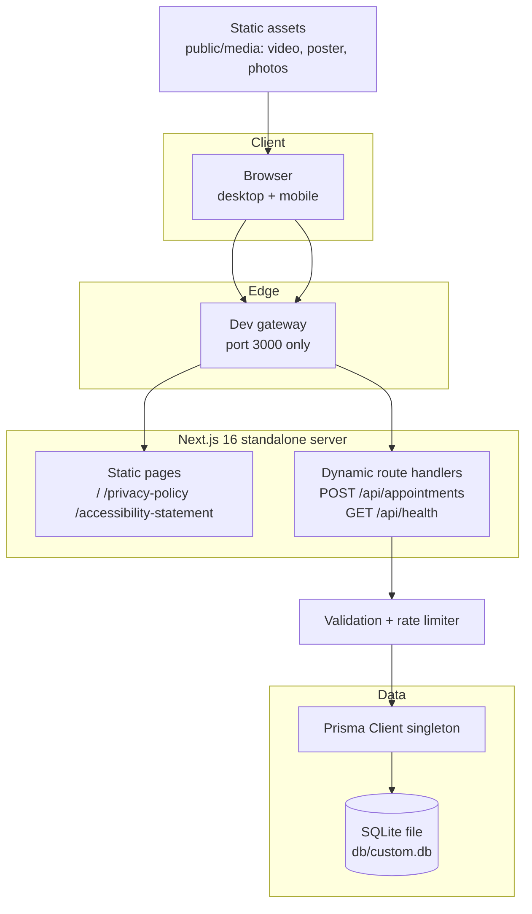
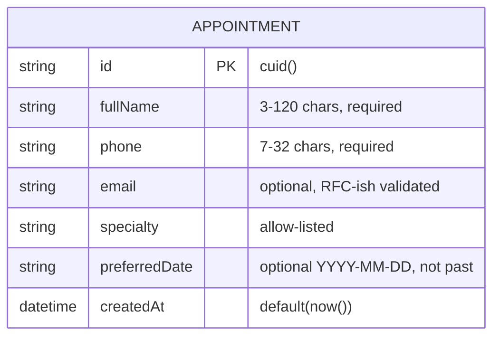

# Green Grove Family Clinic — Master Project Architecture Document (PAD) v1.0.0

**Classification:** Internal Engineering Reference
**Status:** DEFINITIVE, PRODUCTION-LOCKED BLUEPRINT
**Companion Documents:** `README.md` (user-facing), `AGENTS.md` (condensed agent rules), `CLAUDE.md` (agent workflow), `docs/Tailwind-V4-Validation-Report.md` (engine trap log)
**Last Updated:** 2026-10-05
**Audience:** Senior Engineers, Tech Leads, DevOps, and Onboarding Engineers
**Rule:** Every architectural decision in this document traces to a specific rationale. Nothing is here "because it's popular."

---

#### Revision Block — v1.0.0 (Tracked Changes)

- `[SR]` Initial full PAD for the Next.js 16 reconstruction of the reference Base44 clinic site.
- `[SR]` ADR-001..007 recorded: framework, rendering strategy, styling engine port, DB/ORM, API validation, reveal choreography, e2e trap guards.
- `[SR]` Trap log cross-referenced with `docs/Tailwind-V4-Validation-Report.md` (five documented v3→v4 engine variances, all mitigated in this codebase).

---

## Table of Contents

1. [System Overview & Decisions](#1-system-overview--decisions)
2. [High-Level System Topology](#2-high-level-system-topology)
3. [Application Architecture](#3-application-architecture)
4. [Data Architecture](#4-data-architecture)
5. [Design System Reference](#5-design-system-reference)
6. [Security Architecture](#6-security-architecture)
7. [Testing Strategy](#7-testing-strategy)
8. [Build & Deployment](#8-build--deployment)
9. [Developer Handbook](#9-developer-handbook)
10. [Known Issues & Outstanding Tasks](#10-known-issues--outstanding-tasks)
11. [Key Files Reference](#11-key-files-reference)
12. [Glossary](#12-glossary)

---

## 1. System Overview & Decisions

### 1.1 Document Metadata & Purpose

This is the single source of truth for how the clinic site is built, why
each choice was made, and how the pieces fit. Use it when onboarding,
debugging a rendering or data issue, reviewing a technical choice, or
extending the site (new sections, new write paths, new pages).

**What this project is:** a reconstruction of the reference landing
experience (`https://health-care-clinic.base44.app/`) with a real backend.
**What "done" means:** verification gate green AND computed-metric parity
with the reference at desktop and mobile widths.

### 1.2 Technology Stack Summary

| Layer | Technology | Version | Key Rationale |
| ----- | ---------- | ------- | ------------- |
| Web framework | Next.js (App Router, `output: "standalone"`) | 16.x | Server Components for a content-static marketing page; one deployable artifact; route handlers for the API |
| UI runtime | React | 19.x | Required by Next 16; client islands only where interaction demands them |
| Language | TypeScript (strict) | 5.x | Compile-time contracts for content, API payloads, and DOM API usage |
| Styling | Tailwind CSS via `@tailwindcss/postcss` | 4.x | Reference uses v3; v4 is the current engine — the port neutralizes the documented deltas (see ADR-003) |
| Font | DM Sans via `next/font/google` | 400/500/600/700 | Reference font; `next/font` removes render-blocking Google CSS and provides a fallback metric |
| Icons | lucide-react | 0.525.x | The reference's icon set — identical glyph geometry |
| ORM | Prisma | 6.x | SQLite + typed client; single-model schema; env-resolved URL with a tested path contract |
| Database | SQLite | (via Prisma) | Zero-config local dev and single-node production; the write volume (appointment requests) is trivial |
| Unit tests | Vitest | 5.x | Fast pure-seam tests; matches `*.test.ts` only so Playwright specs never double-run |
| E2E tests | Playwright | 1.x | Real browser parity verification; boots the standalone production server |

### 1.3 Architecture Decision Records (ADRs)

**ADR-001: Next.js 16 App Router over a Vite SPA (like the reference)**

- **Context:** The reference is a client-rendered Vite SPA. A clone could
  copy that shape, but the repo's deployment story (standalone Node server)
  and the need for a server-side write path argue for a full framework.
- **Decision:** Next.js 16 App Router with `output: "standalone"`; landing
  and legal pages are statically prerendered; API routes are dynamic.
- **Rationale:** Static prerendering ships the full HTML to crawlers and
  no-JS visitors (the reference ships an empty shell); the appointment
  write path needs a server; the standalone build is one artifact.
- **Consequences:** + SSR/hydration discipline required (see ADR-006);
  + the Next dev-origin quirk must be configured (`allowedDevOrigins`);
  − slightly heavier build than Vite.
- **Alternatives Rejected:** Vite SPA (no server write path, no SSR);
  Remix (team stack alignment); plain static export (no API routes).

**ADR-002: Server Components by default; four client islands**

- **Context:** The page is 95% static content; only the header chrome
  (menu + scroll-spy), hero badge rotation, appointment form, and reveal
  choreography hold state.
- **Decision:** `Header`, `Hero`, `AppointmentForm`, `Reveal` are
  `"use client"`; everything else is a Server Component.
- **Rationale:** Minimal client JS; the content tree stays serializable;
  the client islands are precisely the interactive surfaces the e2e
  specs cover.
- **Consequences:** Client islands must not import content data that
  changes server-side render output (all copy is static and shared).
- **Alternatives Rejected:** All-client tree (needless JS); islands
  architecture via a third-party framework (unnecessary).

**ADR-003: Tailwind CSS v4 port with an explicit trap-mitigation layer**

- **Context:** The reference's compiled CSS is Tailwind v3. Rebuilding on
  v3 would maximize class-level compatibility but ship a legacy engine;
  the repo's skills and validation report document exactly how v4 differs.
- **Decision:** v4 CSS-first (`@theme inline` + `:root`/`.dark` vars),
  with five documented mitigations: full-`hsl()` theme values; pinned
  `--shadow-sm`; arbitrary sRGB gradients; grid instead of `space-y` in
  stacked UI; suffix `!important` syntax.
- **Rationale:** v4 is the maintained engine; every delta it introduces is
  measurable and therefore neutralizable. Computed-metric parity was
  verified element-by-element against the live reference.
- **Consequences:** + future-proof engine; − every new contributor must
  know the trap list (encoded in `AGENTS.md` and the e2e guards);
  − computed colors surface as `oklab(...)` strings, so tests rasterize
  pixels instead of string-matching.
- **Alternatives Rejected:** v3 + `@config` bridge (legacy path, slower,
  documented as a dead end); hand-written CSS (loses the utility parity
  with the reference's class strings).

**ADR-004: SQLite + Prisma with a unit-tested URL-resolution contract**

- **Context:** The only write path is appointment requests — volume is
  low, contention is nil, and ops simplicity matters.
- **Decision:** SQLite through Prisma; `DATABASE_URL` as a relative
  `file:` URL resolved by `src/lib/db-path.ts` (pure function, 15 unit
  tests) against the repo that owns `prisma/schema.prisma`.
- **Rationale:** The relative-path resolution is the classic "works in
  dev, breaks in the standalone build" trap — so it is a tested seam, not
  folklore. Absolute URLs and non-SQLite URLs pass through untouched.
- **Consequences:** Single-writer semantics (fine for this workload);
  `db/*.db` is gitignored; e2e gets its own scratch DB via env.
- **Alternatives Rejected:** PostgreSQL (no operational need at this
  scale; the repo's `rootless-postgresql` skill exists if it ever does);
  raw `sqlite3` (no typed client).

**ADR-005: Manual validation + fixed-window rate limit in the route handler**

- **Context:** One endpoint, seven field rules, no schema-library
  dependency in the scaffold's package.json.
- **Decision:** Hand-rolled validators with an allow-list for specialty;
  in-memory per-IP fixed window (5 req / 10 min) with an unref'd sweeper.
- **Rationale:** The validation surface is small and enumerable; an
  allow-list (not a pattern) for specialty eliminates a whole injection
  class; the limiter matches the single-process deployment shape.
- **Consequences:** If the app is ever horizontally scaled, the limiter
  must move to a shared store (documented in §6).
- **Alternatives Rejected:** Zod (added dependency for 7 rules); no
  limiter (the form is public).

**ADR-006: Hydration-safe reveal choreography via `@media (scripting: enabled)`**

- **Context:** The reference animates cards in with Framer Motion
  `whileInView`. A naive port (initial state from
  `typeof IntersectionObserver`) produces a server/client attribute
  mismatch — observed and fixed during the build.
- **Decision:** Server and client render the same initial
  `data-reveal="hidden"` markup; the hiding CSS is scoped to
  `@media (scripting: enabled)`; an IntersectionObserver flips the
  attribute post-hydration; `prefers-reduced-motion` pins content visible.
- **Rationale:** Identical initial markup = no hydration mismatch; the
  media feature degrades gracefully (crawlers/no-JS see final state);
  zero animation dependencies.
- **Consequences:** The CSS (not JS) is the no-JS safety net — keep the
  `scripting:` scoping when editing.
- **Alternatives Rejected:** Framer Motion (dependency + hydration risk);
  CSS-only scroll-driven animations (browser support).

**ADR-007: Playwright trap guards as executable documentation**

- **Context:** The v4 traps are easy to reintroduce silently (a "cleanup"
  of globals.css could regress the theme format).
- **Decision:** The e2e suite encodes the traps as assertions: rasterized
  pixel checks for the nav pill/dropdown colors (transparent-collapse
  guard), panel geometry bounds, breakpoint-symmetry at exactly 1023/1024.
- **Rationale:** A failing regression test is louder than a comment.
- **Consequences:** The color assertions must rasterize (oklab string
  formats) and tolerate ±1 quantization.
- **Alternatives Rejected:** Visual snapshot diffs (flake-prone against
  the video hero); comment-only warnings.

---

## 2. High-Level System Topology



- **Client layer:** standard browsers; the only exotic requirement is the
  hero video codec (H.264 MP4 — vendored from the reference CDN).
- **App layer:** one Node process (dev: `next dev`; production:
  `.next/standalone/server.js`). Static pages are prerendered; API routes
  are dynamic (force-dynamic by virtue of route handlers reading the DB).
- **Data layer:** a single SQLite file; the Prisma client is a
  `globalThis` singleton in dev for hot-reload safety.
- **External services:** none at runtime. All media is vendored locally
  (`public/media/`) so the app is self-contained.

---

## 3. Application Architecture

### 3.1 The Layer Model

```
Layer 0: app shell       — src/app/layout.tsx + globals.css. Owns fonts,
                           viewport, and the design tokens. Rule: no
                           component-specific CSS lives here.
Layer 1: route surface   — page.tsx + legal pages + API route handlers.
                           Owns composition and HTTP contracts. Rule: no
                           markup beyond section composition.
Layer 2: section comps   — src/components/site/*. Server Components by
                           default; client islands marked "use client".
                           Rule: copy comes from content.ts, never inline.
Layer 3: content + data  — src/lib/content.ts (typed site copy) and
                           src/lib/db.ts / db-path.ts (persistence seam).
                           Rule: pure, testable, no React imports.
Layer 4: persistence     — prisma/schema.prisma. Rule: one model, one
                           write path; changes flow through db:push.
```

**Golden Rule:** a change to visual copy belongs in Layer 3; a change to
layout belongs in Layer 2; a change to tokens belongs in Layer 0. Nothing
in Layers 0–3 imports upward.

### 3.2 Annotated Directory Structure

```
health-care-clinic/
├── src/
│   ├── app/
│   │   ├── globals.css              ← THE design system: @theme inline tokens,
│   │   │                               unlayered heading rules, reveal CSS
│   │   ├── layout.tsx               ← DM Sans, metadata, viewport-fit=cover
│   │   ├── page.tsx                 ← landing composition (Header → Footer)
│   │   ├── api/
│   │   │   ├── appointments/route.ts ← POST: validate → limit → persist
│   │   │   └── health/route.ts      ← GET: SELECT 1 probe
│   │   ├── privacy-policy/page.tsx
│   │   └── accessibility-statement/page.tsx
│   ├── components/site/
│   │   ├── header.tsx               ← client: mobile menu, scroll-spy, pastHero
│   │   ├── hero.tsx                 ← client: video, rotating badge, CTA
│   │   ├── about.tsx                ← server: coverage card + numbered list
│   │   ├── services.tsx             ← server: gradient band + 8 reveal cards
│   │   ├── differentiators.tsx      ← server: 4 pillars
│   │   ├── insurance.tsx            ← server: photo card + partner marks
│   │   ├── team.tsx                 ← server: 3 physician cards
│   │   ├── contact.tsx              ← server: info columns + form panel
│   │   ├── appointment-form.tsx     ← client: submit states
│   │   ├── faq.tsx                  ← server: native details accordion
│   │   ├── footer.tsx               ← server: facts + legal links
│   │   ├── legal-page.tsx           ← server: shared legal shell
│   │   └── reveal.tsx               ← client: IntersectionObserver reveal
│   └── lib/
│       ├── content.ts               ← ALL copy, icon maps, nav links (as const)
│       ├── db.ts                    ← Prisma singleton with env-resolved URL
│       └── db-path.ts               ← pure URL resolution (unit-tested)
├── prisma/schema.prisma             ← Appointment model
├── tests/
│   ├── db-path.test.ts              ← 15 unit cases (Vitest)
│   └── e2e/                         ← 22 specs (Playwright)
│       ├── global-setup.ts          ← pushes schema to db/e2e.db
│       ├── mobile-navigation.spec.ts ← chrome contract + trap guards
│       ├── landing.spec.ts
│       ├── appointment-form.spec.ts
│       └── legal-pages.spec.ts
├── public/media/                    ← hero video + poster, 5 section photos
├── docs/
│   ├── Tailwind-V4-Validation-Report.md ← engine trap log (authoritative)
│   ├── DEPLOYMENT.md                ← production runbook
│   ├── how-to-git-push-using-ssh-wrapper_SKILL.md
│   ├── ssh_git_wrapper_v3.py        ← SSH push wrapper (keys stay outside)
│   └── screenshots/                 ← 15 captured states
├── AGENTS.md · CLAUDE.md · README.md · this file
└── next.config.ts                   ← standalone + allowedDevOrigins + no dev overlay
```

### 3.3 Critical Code Patterns

**Pattern 1 — The token indirection (globals.css)**

```css
@theme inline {
  /* Full hsl() values ONLY — a bare triplet resolves to transparent
     under `@theme inline` (Validation Report, Trap Log #1). */
  --color-primary: var(--primary);
  --shadow-sm: 0 1px 2px 0 rgb(0 0 0 / 0.05); /* v3 geometry pin (Trap #5) */
}
:root { --primary: hsl(151 32% 22%); }
.dark { --primary: hsl(50 58% 82%); }
```

*Why this pattern:* `@theme inline` makes utilities emit
`background-color: var(--primary)`, so the `.dark` block can override at
runtime without regenerating utilities. The `inline` keyword is also what
turns bare triplets transparent — hence the full-value rule.

**Pattern 2 — The unlayered base cascade (globals.css)**

```css
/* UNLAYERED on purpose: these !important rules must beat non-important
   utilities (h2 always renders 48/60px) yet LOSE to !important utilities
   (the legal pages' `text-2xl!`). Layered !important would invert the
   first requirement; unlayered !important satisfies both. */
h2 { font-size: 3rem !important; line-height: 1.05 !important; }
@media (min-width: 640px) { h2 { font-size: 3.75rem !important; } }

/* The opposite placement: IN @layer base so normal utilities win. */
@layer base {
  @media (max-width: 639px) { body, p { font-size: 14px; } }
}
```

*Why this pattern:* the reference's own CSS has no cascade layers; its
outcome is pure specificity. Reproducing it under v4's layered utilities
requires placing each custom rule on the correct side of the layer
boundary individually.

**Pattern 3 — Hydration-safe reveal (reveal.tsx + globals.css)**

```tsx
// Server AND client render data-reveal="hidden" on first paint — the
// attribute only flips after the observer fires, so hydration matches.
const [shown, setShown] = useState(false);
useEffect(() => {
  const node = ref.current;
  if (!node || shown) return;
  const observer = new IntersectionObserver((entries) => {
    for (const e of entries)
      if (e.isIntersecting) { setShown(true); observer.disconnect(); }
  }, { threshold: 0.15 });
  observer.observe(node);
  return () => observer.disconnect();
}, [shown]);
```

```css
@media (scripting: enabled) {
  [data-reveal] { opacity: 0; transform: translateX(var(--card-x, 0px)) translateY(var(--card-y, 0px)); transition: opacity .7s cubic-bezier(.22,1,.36,1), transform .7s cubic-bezier(.22,1,.36,1); }
  [data-reveal="shown"] { opacity: 1; transform: none; }
}
```

*Why this pattern:* initializing state from `typeof IntersectionObserver`
makes server markup ("shown") diverge from client markup ("hidden") — the
exact hydration error observed during the build. Scoping the hiding CSS to
`scripting: enabled` makes raw HTML (crawlers, no-JS) render the settled
state with zero JS.

**Pattern 4 — Rasterized color assertions (mobile-navigation.spec.ts)**

```ts
const renderedPixel = (selector: string) =>
  page.locator(selector).evaluate((el) => {
    const canvas = document.createElement("canvas");
    canvas.width = canvas.height = 1;
    const ctx = canvas.getContext("2d")!;
    ctx.fillStyle = getComputedStyle(el).backgroundColor;
    ctx.fillRect(0, 0, 1, 1);
    return Array.from(ctx.getImageData(0, 0, 1, 1).data);
  });
expect(near(await renderedPixel("header div.h-12"), [38, 74, 57, 204])).toBe(true);
```

*Why this pattern:* v4's opacity modifiers compute as `oklab(...)`
(color-mix) while v3 surfaced `rgba(...)` — identical paint, incompatible
strings. Rasterizing proves the PAINT and catches the real regression
(a bare-HSL theme collapse to `[0,0,0,0]`). The ±1 tolerance absorbs the
oklab roundtrip's quantization step.

---

## 4. Data Architecture

### 4.1 Database Schema



Single table `appointments` (mapped from the `Appointment` model), indexed
on `createdAt` for retention sweeps.

### 4.2 Persistence Strategy

- **Client:** Prisma Client instantiated once per process
  (`globalThis` cache in dev). `log: ['query']` in dev, `['error']` in
  production.
- **URL resolution:** relative `file:` URLs resolve against the repo that
  owns `prisma/schema.prisma` — the pure function
  `resolveDatabaseUrl(envUrl, anchors)` and its 15 unit tests pin the
  contract across `next dev`, `next build`, and the standalone server.
- **Migrations:** schema-first via `prisma db push` (dev) — appropriate
  for a single-model greenfield; adopt `prisma migrate` if the model grows
  relational complexity.

---

## 5. Design System Reference

### 5.1 Typographic System

| Element | Rule | Source |
| ------- | ---- | ------ |
| Font | DM Sans 400/500/600/700 via `next/font` (`--font-dm-sans`) | reference `@import` |
| h1 | utility-driven (`text-5xl sm:text-7xl lg:text-[clamp(6.25rem,8.5vw,8.5rem)]`), weight forced 400 | reference base layer |
| h2 | **48px base / 60px at sm+ (always), line-height 1.05, letter-spacing -.04em, weight 400** | reference `h2{...!important}` |
| h3 | **20px, line-height 1.25, weight 400 (always)** | reference `h3{...!important}` |
| p / body | 16px base; **14px under 640px** (layered so utilities win) | reference media rule |
| `.about-subtitle` | 14px → 20px at sm+, `text-wrap: balance` | reference custom class |
| `.section-subtitle` | 14px → 22px at sm+ | reference custom class |

### 5.2 Color Tokens (light)

| Token | Value | Usage |
| ----- | ----- | ----- |
| `--background` | `hsl(205 50% 96%)` | page |
| `--foreground` = `--primary` | `hsl(151 32% 22%)` | clinic green |
| `--primary-foreground` | `hsl(50 58% 88%)` | sand on primary |
| `--hero-foreground` | `hsl(0 0% 100%)` | white on hero/pill |
| `--card` / `--popover` | `hsl(54 38% 98%)` | warm white cards |
| `--secondary` | `hsl(49 62% 82%)` | footer tan |
| `--muted` / `--muted-foreground` | `hsl(203 28% 90%)` / `hsl(153 18% 35%)` | secondary text |
| `--accent` | `hsl(205 42% 91%)` | rails, team cards |
| `--border` = `--input` | `hsl(151 18% 78%)` | sage borders |
| `--provider-panel` | `hsl(0 0% 100%)` | team quote panels, form panel |
| `--service-gradient-top/middle/bottom` | `hsl(48 33% 96%)` / `hsl(3 27% 89%)` / `hsl(41 88% 70%)` | services + team bands |

A full dark token set exists under `.dark` (ported verbatim) but the UI
exposes no toggle — same as the reference.

### 5.3 Component Primitives

No component library in the render path. The reference's own primitives
are reproduced with elements + utilities: pill nav (`bg-foreground/80
backdrop-blur-md`), dropdown menu panel (`rounded-[24px] bg-foreground/90
shadow-lg backdrop-blur-md`, GRID layout), underline inputs
(`border-b border-primary/40`), native `<details>` FAQ, `rounded-[50%]`
icon badges. Radix deps remain installed but unused — candidates for
removal if the dependency budget tightens.

### 5.4 Motion / Animation

| Animation | Implementation | Reduced-motion |
| --------- | -------------- | -------------- |
| Hero badge rotation | 2.5s interval + keyed `badge-enter` keyframe (fade + 6px rise) | `animation: none` |
| ECG heartbeat | `animate-heartbeat` — 2.8s ease-in-out alternate `translateX(0 → -32px)` sweep of a 96×32 SVG track | (decorative, low-motion impact) |
| Card reveal | `[data-reveal]` transitions from `--card-x/--card-y` offsets, 0.7s quint-out | pinned visible |
| Nav underline | `after:` scale-x transition 300ms | transform-only |
| FAQ plus | `group-open:rotate-45` (v4 standalone `rotate`) | n/a |
| CTA scroll | `scrollIntoView({behavior:"smooth"})` | browser-controlled |

---

## 6. Security Architecture

### 6.1 Security Rules

| # | Rule | Enforcement |
| - | ---- | ----------- |
| 1 | All external input validated server-side | `route.ts` validators; 422 + field map on failure |
| 2 | Specialty is allow-listed, never free text | `ALLOWED_SPECIALTIES` set |
| 3 | Rate limit public write endpoints | fixed-window per-IP map (5/10min) → 429 |
| 4 | No PII echo in responses or logs | success returns `{ok, id}` only; errors log messages, not payloads |
| 5 | Secrets never committed | `.gitignore` (`*.key`, `.env`, `ssh-key.txt`); push via the SSH wrapper with keys outside the repo |
| 6 | Dates rejected in the past | parsed + compared to local midnight |

### 6.2 Security Utilities

- `rateLimited(ip)` — fixed-window counters with an unref'd sweeper timer.
- `asTrimmedString` — coerces unknown JSON values to trimmed strings or null.
- Email sanity: single RFC-ish pattern (no regex on other fields — length
  bounds only, avoiding ReDoS-prone patterns on names/phones).

### 6.3 Authentication & Authorization

None — the site has no accounts by design ("No account needed. We'll
confirm your visit by phone"). The write API is public but validated and
rate-limited. If an admin surface is ever added, put it behind the
scaffold's NextAuth option and gate `/api/appointments` reads.

### 6.4 Threat Model

| Vector | Mitigation |
| ------ | ---------- |
| Form spam / flooding | per-IP rate limit; required-field validation |
| Injection into stored fields | Prisma parameterized queries; length caps |
| XSS via reflected input | React escaping; API never echoes payloads |
| Secret leakage | gitignored env; wrapper-based push; response minimization |
| Prototype pollution via JSON body | explicit field extraction (never spread into objects) |

---

## 7. Testing Strategy

### 7.1 Test Distribution

| Category | Files | Tests | Location | Framework |
| -------- | ----- | ----- | -------- | --------- |
| Unit (pure seams) | 1 | 15 | `tests/db-path.test.ts` | Vitest |
| E2E chrome contract | 1 | 8 | `tests/e2e/mobile-navigation.spec.ts` | Playwright |
| E2E landing parity | 1 | 8 | `tests/e2e/landing.spec.ts` | Playwright |
| E2E write path | 1 | 4 | `tests/e2e/appointment-form.spec.ts` | Playwright |
| E2E legal pages | 1 | 3 | `tests/e2e/legal-pages.spec.ts` | Playwright |

### 7.2 Test Patterns

- **Trap guards as tests** (ADR-007): rasterized pixel colors, panel
  geometry bounds, breakpoint symmetry at exactly 1023/1024px.
- **Contract pinning:** anchor ids, aria states, video attributes, CTA
  scroll destinations, DB round-trip through the real standalone server.
- **Flake discipline:** no in-flight state assertions against fast local
  APIs; no hover assertions (v4 `@media (hover: hover)` wrapping).

### 7.3 Coverage Thresholds

No numeric threshold configured (content-rendering app; the meaningful
coverage is the parity surface). The gate is pass/fail: 15/15 unit,
22/22 e2e.

### 7.4 Pre-Push Checklist

- [ ] `bun run lint` — 0 errors
- [ ] `bun run typecheck` — clean
- [ ] `bun run test` — 15/15
- [ ] `bun run build` — standalone output produced
- [ ] `bun run test:e2e` — 22/22 (requires the build)
- [ ] `git status` clean of secrets/artifacts before commit

---

## 8. Build & Deployment

### 8.1 Production Build

```bash
bun run build
# → .next/standalone/server.js (+ traced static assets)
bun .next/standalone/server.js   # PORT, DATABASE_URL from env
```

`outputFileTracingRoot` is pinned to the repo so a clone inside a parent
workspace still lands the server at `.next/standalone/server.js`.

### 8.2 Environment Variables

| Name | Required | Description | Default |
| ---- | -------- | ----------- | ------- |
| `DATABASE_URL` | yes | SQLite URL; relative `file:` resolves against the schema repo | `file:../db/custom.db` |
| `NEXT_PUBLIC_SITE_URL` | no | canonical origin for metadata | `http://localhost:3000` |

### 8.3 Docker Configuration

None (single Node artifact + SQLite file). The deployment shape is
documented in `docs/DEPLOYMENT.md` — copy the standalone dir, the
`public/` assets, and an absolute-path `DATABASE_URL`.

### 8.4 CI/CD Pipeline

No hosted CI (no `.github/workflows`). The local gate (§7.4) is the only
gate; the SSH wrapper's rules require it green before pushing `main`.

---

## 9. Developer Handbook

### 9.1 Local Setup

```bash
bun install
cp .env.example .env
bun run db:push
bun run dev            # verify: curl localhost:3000/api/health
```

### 9.2 Common Commands

| Command | Purpose |
| ------- | ------- |
| `bun run dev` | dev server on :3000 (logs to `dev.log`) |
| `bun run lint` / `typecheck` / `test` | quality gates |
| `bun run build` / `start` | standalone production build / serve |
| `bun run test:e2e` | Playwright suite (build first) |
| `bun run db:push` / `db:generate` | schema sync / client regen |

### 9.3 Code Style Rules

- TypeScript strict; ESLint flat config; hooks rules enforced (see the
  `set-state-in-effect` note in CLAUDE.md).
- Comments justify *why* (engine traps, cascade reasoning), not *what*.
- Copy changes go through `src/lib/content.ts`.

### 9.4 Git Workflow

- `main` only; Conventional Commits; atomic commits.
- Push: `python3 docs/ssh_git_wrapper_v3.py --key-file <key outside repo>
  --remote git@github.com:nordeim/health-care-clinic.git` (runbook:
  `docs/how-to-git-push-using-ssh-wrapper_SKILL.md`).

---

## 10. Known Issues & Outstanding Tasks

| Priority | Issue | Impact | Status |
| -------- | ----- | ------ | ------- |
| LOW | Radix UI dependencies installed but unused | bundle unaffected (tree-shaken), install weight only | Open — remove if budget tightens |
| LOW | Dark token set ships without a UI toggle | none (inert CSS, mirrors reference) | Open by design |
| LOW | Rate limiter is per-process memory | resets on restart; wrong under horizontal scaling (not the deployment shape) | Documented in §6 |
| INFO | ±1/255 oklab quantization drift on opacity-modified colors | imperceptible; asserted with tolerance in e2e | Accepted (ADR-003) |

---

## 11. Key Files Reference

| File | Lines | Purpose |
| ---- | ----- | ------- |
| `src/app/globals.css` | ~250 | Design system: tokens, unlayered base cascade, reveal CSS, custom classes |
| `src/components/site/header.tsx` | ~180 | Fixed chrome: mobile menu, scroll-spy, pastHero color swap |
| `src/components/site/services.tsx` | ~110 | Gradient band + stacked-entrance cards |
| `src/components/site/appointment-form.tsx` | ~150 | The write path UI with submit states |
| `src/components/site/reveal.tsx` | ~80 | Hydration-safe reveal choreography |
| `src/lib/content.ts` | ~190 | All site copy, icon maps, nav contracts |
| `src/app/api/appointments/route.ts` | ~170 | Validation, rate limiting, persistence |
| `src/lib/db-path.ts` | ~110 | Pure SQLite URL resolution (tested seam) |
| `tests/e2e/mobile-navigation.spec.ts` | ~170 | Chrome contract + Tailwind v4 trap guards |
| `docs/Tailwind-V4-Validation-Report.md` | ~310 | Authoritative engine trap log |

---

## 12. Glossary

| Term | Meaning |
| ---- | ------- |
| **Reference** | the live Base44 app (`health-care-clinic.base44.app`) — the parity target |
| **Trap (v3→v4)** | a documented engine-level output difference between Tailwind CSS versions; see the Validation Report |
| **Past-hero state** | `scrollY >= innerHeight`; swaps the logo/roundel to `text-primary` |
| **Scroll-spy** | marks the last nav-tracked section whose top crossed the viewport midline |
| **Reveal** | the entrance choreography (offset → settle) via `[data-reveal]` + IntersectionObserver |
| **Pill** | the dark-green blurred container holding desktop nav, CTA, and hamburger |
