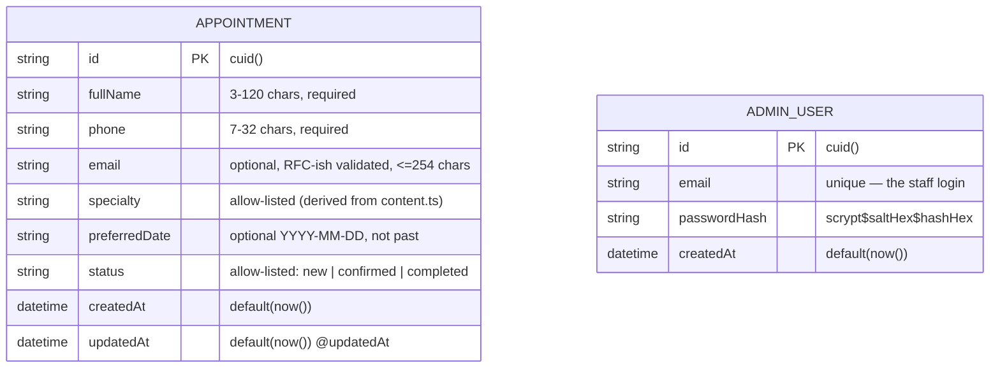

# Green Grove Family Clinic — Master Project Architecture Document (PAD) v1.0.0

**Classification:** Internal Engineering Reference
**Status:** DEFINITIVE, PRODUCTION-LOCKED BLUEPRINT
**Companion Documents:** `README.md` (user-facing), `AGENTS.md` (condensed agent rules), `CLAUDE.md` (agent workflow), `docs/Tailwind-V4-Validation-Report.md` (engine trap log)
**Last Updated:** 2026-10-06
**Audience:** Senior Engineers, Tech Leads, DevOps, and Onboarding Engineers
**Rule:** Every architectural decision in this document traces to a specific rationale. Nothing is here "because it's popular."

---

#### Revision Block — v1.1.0 (Tracked Changes)

- `[SR]` Initial full PAD for the Next.js 16 reconstruction of the reference Base44 clinic site.
- `[SR]` ADR-001..007 recorded: framework, rendering strategy, styling engine port, DB/ORM, API validation, reveal choreography, e2e trap guards.
- `[SR]` Trap log cross-referenced with `docs/Tailwind-V4-Validation-Report.md` (five documented v3→v4 engine variances, all mitigated in this codebase).
- `[S2]` Session-2 audit + remediation (see `docs/remediation-plan-session2.md`): ADR-008..010 recorded — dependency-free cookie session auth, the staff dashboard beyond-parity extension, and the `env -u DATABASE_URL` determinism guard. `.env.example` rewritten to match the codebase; `db:seed` added; auth unit + e2e layers added (29 unit / 27 e2e total).
- `[S4]` Session-4 re-audit (see `docs/remediation-plan-session4.md`): live parity re-verified against the reference (7490px, heading scales, mobile menu panel byte-exact); the annotated tree below brought up to date with the session-2 surfaces; the semantic-`<title>` deviation from the reference's `"Base44 APP"` platform placeholder recorded in the validation report and pinned by `toHaveTitle` e2e assertions (28 e2e); `braces`/`deepmerge-ts` advisories re-verified unfixable upstream (accepted dev-time risk); SKILL.md destructive-token typo corrected.
- `[S6]` Session-6 scaffold cleanup (see `docs/remediation-plan-session6.md`): the pre-clone legacy removed — 14 ORBITAL-era scripts out of `scripts/` (kept `seed.ts`), 15 unused scaffold dependencies (8× @radix-ui, cva, clsx, tailwind-merge, tailwindcss-animate, tw-animate-css, zustand, z-ai-web-dev-sdk) plus the dead shadcn `components.json`, and the two committed ssh shims that violated the push runbook's "never commit the shim" rule. The dependency allowlist is now pinned by `tests/deps.test.ts` (unit suite 29 → 33). Cleanup proven behavior-neutral: identical build route table, 28/28 e2e, live parity byte-exact before and after; product loop re-verified under an active ambient `DATABASE_URL` hijack value.
- `[S8]` Session-8 HTTP-edge hardening (see `docs/remediation-plan-session8.md`): a fresh-eyes audit surfaced the login user-enumeration TIMING oracle (unknown email short-circuited scrypt), first-token XFF rate-limit keying, the client discarding the 422 field map, impossible calendar dates passing via JS Date rollover, reveal content lost on client-bundle failure, the heartbeat animation's missing reduced-motion guard, and a tel: href parity deviation. Remediated TDD-first with two new pure seams (`src/lib/validation.ts` — calendar round-trip rejection + specialty allowlist derived from content.ts; `src/lib/rate-limit.ts` — LAST-token XFF keying + fixed-window limiter + 64 KiB body cap), `DUMMY_HASH`/`verifyLoginPassword` timing equalization in auth.ts, per-field 422 rendering with aria wiring in both forms, the reveal self-heal timer (inline script, cancelled by the first Reveal mount), true TS strict (noImplicitAny; ignoreBuildErrors removed so the build enforces types), `metadataBase` wired to NEXT_PUBLIC_SITE_URL, `@types/node` declared, and an explicit playwright AUTH_SECRET. Unit suite 33 → 65; e2e 28 → 34; live parity re-verified byte-exact; product loop green under the active ambient hijack.
- `[S10]` Session-10 edge closure + robustness (see `docs/remediation-plan-session10.md`): the fresh-eyes audit found what session 8's own hardening had left half-open — `POST /api/auth/login` 500'd on a JSON `null` body (property access outside the parse try/catch), the 64 KiB body cap trusted only `content-length` so CHUNKED requests bypassed it entirely (verified live: a 70 KiB chunked POST buffered and parsed), and `scryptSync` blocked the event loop ~30-50 ms per login attempt (spoofed-key bursts starved every concurrent request). Remediated TDD-first: `readJsonBody` seam in `rate-limit.ts` (stream-read with the hard byte cap for every transport shape, socket cancelled on breach), the login non-object-body guard (422 field map, e2e-pinned on both routes), `promisify(scrypt)` (identical CPU on the libuv threadpool — DUMMY_HASH and the timing-equalization contract untouched; verified live: health polls interleave during concurrent scrypt logins), a one-day west-of-server timezone tolerance on the not-in-the-past floor, `src/lib/motion.ts` `scrollBehavior()` for reduced-motion instant jumps in both CTA handlers, and per-run spoofed XFF keys in the limiter e2e specs (a `reuseExistingServer` instance can no longer poison buckets). Unit suite 65 → 76; e2e 34 → 37; live parity re-verified byte-exact (mobile link-click identical to the pixel, same session, same method); product loop green under the still-active ambient hijack; 11 screenshots refreshed.
- `[S12]` Session-12 email bound + transport tolerance + lint-gate honesty (see `docs/remediation-plan-session12.md`): the fresh-eyes audit found the email field was the only UNBOUNDED payload field (a pattern-valid 60,012-char email persisted — verified live), transport read errors escaped `readJsonBody` and both routes' try/catch as unhandled framework errors (ECONNRESET verified live via a raw-socket mid-body abort), the "lint 0" gate ran with ~24 rules silently disabled, plus: logout fetch without a catch, `reactStrictMode` off without recorded rationale, the "Upcoming visits" stat stricter than the validation tolerance, a non-string `specialty` silently coercing to the default (`{"specialty":42}` → 201 "Primary Care"), seed's dead-code disconnect, and the login route's hand-copied email regex. Remediated TDD-first: `EMAIL_MAX_LENGTH = 254` (255 → 422, 254 → 201, boundary live-probed), the read loop wrapped so transport failures cancel and degrade to 400 (routes always resolve now), specialty type tightening (present-but-non-string → 422; missing/nullish keep the default), `upcomingVisitsFloor()` sharing `toleranceFloorDate()` with the preferredDate validation (stat and API can never disagree), logout `.catch`, seed `process.exitCode`, login importing the seam's `EMAIL_PATTERN`, and a rewritten `eslint.config.mjs` — 13 correctness/dep-safety rules ON at 0 findings, every remaining off documented (no-undef: TS type-only globals; no-img-element: parity `` ports). The three root-href `no-html-link-for-pages` hits converted to `next/link`. New login-limiter e2e pin (10 × 401 then 429 under a per-run 198.51.100.x spoofed key). Unit suite 76 → 85; e2e 37 → 38; live parity re-verified byte-exact (7490px; mobile link-click 0.421875 both sites); 20 screenshots refreshed.
- `[S14]` Session-14 footer completion + e2e cross-run keys + security headers + login email bound + transport-message curation (see `docs/remediation-plan-session14.md`): the fresh-eyes audit surfaced the residuals five prior audits missed — the two FOOTER legal links still plain `<a>` (and the discovery that `no-html-link-for-pages` is structurally blind to non-root App-Router routes: href normalization appends a trailing slash the route regexes lack, so only root-href anchors can ever match — the rule's blind spot is now recorded in the eslint config and audits must grep for page-href anchors manually), the impossible-dates e2e spec posting 3 requests under a FIXED XFF key (cross-run 429 flake — the session-10 F6 per-run-key doctrine is now applied to EVERY request-level spec via module constants with spec-unique third octets), zero standard security headers with `X-Powered-By` exposed (`next.config.ts` now applies nosniff / X-Frame-Options DENY / Referrer-Policy to every route and suppresses X-Powered-By — e2e-pinned, rendering-invisible so parity untouched; full CSP documented as the reverse-proxy seam's job), `next build` embedding a byte-identical `.env` (staff password + AUTH_SECRET) into `.next/standalone/.env` (DEPLOYMENT.md now warns: strip or rotate), the login email without the 254 bound the appointments route enforces (login now imports `EMAIL_MAX_LENGTH` — one seam, one bound; 300-char email → 422, no new oracle), a stale dev-PII query-log comment (corrected to Prisma 6.11 reality: SQL templates with `?` placeholders only, bound values NOT printed), and raw "Failed to fetch" engine strings surfacing in both forms (TypeError now curated; e2e-pinned via `page.route().abort()`). Unit suite 85 (unchanged); e2e 38 → 41 (login email bound, security headers, transport-failure message — all TDD Red-first); live parity re-verified byte-exact (7490px; mobile link-click 0.421875 both sites); 20 screenshots refreshed (03-desktop-full exactly 1440×7490).
- `[S16]` Session-16 status management + e2e key determinism + lint-gate strengthening + doc-claim honesty (see `docs/remediation-plan-session16.md`): the fresh-eyes audit found the residuals six prior audits missed — framework-generated 308 trailing-slash redirects carry no security headers while the docs claimed "every route/response" (wording corrected everywhere; both edges — the covered 307 and the bare 308 — are now e2e-pinned), the per-run XFF keys had a ~1/200 back-to-back collision (Date.now() % 200 — replaced by the structurally-unique process pid as the key discriminator), a stale eslint rationale kept `no-non-null-assertion` off (re-enabled; the single DOM-canvas exception is inline-disabled; the gate is now 14 correctness rules ON), the dev/start `tee` pipes mask server exit codes (documented in AGENTS.md), the live staff password appeared verbatim in four living docs as the dotenv-escaping example (neutralized to a placeholder; history scrubbing deliberately skipped — never rewrite pushed main), and PAD §11 line counts plus the README/CLAUDE file inventories had drifted (all re-measured and completed). The session also CLOSED the last documented backlog item: appointment status management — the Appointment model gains `status` (allowlisted string, default "new") + `updatedAt`; a session-guarded, rate-limited (60/10min), body-capped `PATCH /api/appointments/[id]` validates through a new pure seam (`validateStatusUpdate`, allowlist DERIVED from content.ts `appointmentStatuses` — one source of truth for API + UI); the dashboard table gains a Status column (badges + Confirm/Complete client island that PATCHes and `router.refresh()`es). Unit suite 85 → 95 (status seam, 10 cases); e2e 41 → 43 (the UI status loop + PATCH edge pins); live parity re-verified byte-exact (7490px; mobile panel 192x148 @ (178,80); link-click 0.421875 both sites); 20 screenshots refreshed (03-desktop-full exactly 1440x7490; dashboard shots show the status column).
- `[S18]` Session-18 e2e unknown-bucket determinism + dashboard status annunciation + full doc-claim honesty pass (see `docs/remediation-plan-session18.md`): the fresh-eyes audit (11 findings, zero Critical/High/Medium, zero regressions) found the residuals seven prior audits missed — the session-16 F2 "never poison a bucket" claim was overstated for BROWSER-DRIVEN requests: the suite made 3 XFF-less appointments POSTs per run into the shared "unknown" bucket (limit 5/10min), so a second consecutive run against a `reuseExistingServer` instance 429-flaked auth.spec's POST (empirically proven with a double-run repro: run 1 green, run 2 fails at the 6th unknown-bucket POST); the login limiter's unknown bucket took 4 browser logins/run (a third consecutive run would flake). Remediated TDD-first: every browser-driven POST/PATCH now gets its pid-derived per-run key injected via `page.route`/`route.continue` header merge (appointment-form UI_KEY 198.51.106.x, auth APPOINTMENTS_UI_KEY 192.0.5.x + LOGIN_UI_KEY 192.0.6.x, appointments-status LOGIN_UI_KEY 198.51.107.x + PATCH_KEY injection for the StatusButton fetches) — NO request the suite makes touches the "unknown" bucket anymore; the triple-consecutive-run proof went 43/43 × 3 against one persistent server. The dashboard status badge gained `role="status"` (implicit aria-live=polite, WCAG 4.1.3 — the New→Confirmed text mutation now announces; Red-first e2e pin added). The doc pass: README/CLAUDE "13 rules"→14 and "41 tests"→43, StatusButton added to every client-island list, CLAUDE State Management completed, SKILL.md body drift fixed (8 sections, unit breakdown +status 10, Appointment type +status/updatedAt, API contracts +PATCH), PAD §3.2 tree completed, §4.1 ER gained AdminUser + status/updatedAt, §5.3 Radix claim corrected (removed in S6, deps.test.ts-pinned), §5.4 CTA reduced-motion wording, §6.1 APPOINTMENT_SPECIALTIES, §6.3 rewritten to the ADR-008 reality (NextAuth explicitly rejected), §8.2 env table completed, §9.1 +db:seed, §11 re-measured, landing.spec tel: comment corrected. Unit suite 95 (unchanged); e2e 43 (1 extended assertion); live parity re-verified byte-exact (7490px; mobile panel 192×148 @ (178,80); link-click 0.421875 both sites); 20 screenshots refreshed.
- `[S20]` Session-20 the last XFF-less e2e request + config modernization + doc residuals (see `docs/remediation-plan-session20.md`): the fresh-eyes audit (4 findings, zero Critical/High/Medium, zero regressions of any documented session-2/4/6/8/10/12/14/16/18 fix) found the residual ten prior audits hadn't — the session-18 "no request the suite makes touches the shared 'unknown' limiter bucket" claim was still one request short of literal: auth.spec's malformed-payload login POST (`request.post` with NO headers argument) fed the shared "unknown" login bucket once per run; with the login limit at 10/10min, an 11th consecutive run inside the window against a `reuseExistingServer` instance would 429-flake a test asserting 422 (empirically proven at the API level: 10 XFF-less POSTs → 422×10, the 11th → 429 — the same defect class session-18 F8 closed, horizon moved from 3 runs to 10 but the docs claimed "never"). Remediated TDD-first (Red first, then Green): `MALFORMED_KEY = 192.0.7.${pid}` (spec-unique third octet, disjoint from every base in every spec) now headers that request; a paren-balanced structural grep across all six spec files proves EVERY request-level POST/PATCH carries an XFF header and every browser-driven site injects one via `page.route`/`route.continue` (or aborts before reaching the server) — the claim is now literally true. Plus: `vitest.config.ts` → `vitest.config.mts` (the repo has no `"type"` field, so a `.ts` config loaded as CommonJS and Vite deprecated-warned on every `bun run test`; `.mts` loads natively — warning gone; the two living references moved with it: SKILL §3 and the playwright.config comment), README's Testing-block Vitest row gained the status seam and the Architecture E2E row gained "appointment status management" (session-18 F11 fixed the sibling rows, these two were missed), and the 6 realistic dashboard seed rows were restored after the workspace reset (2 confirmed / 2 new / 2 completed — set through the real PATCH API, double-duty live probe). Unit suite 95 (unchanged, now warning-free); e2e 43 + the DOUBLE-consecutive-run proof (43/43 × 2 within the 10-min window); live parity re-verified byte-exact on both sites at a VERIFIED 1440×900 viewport (7490px both; mobile panel 192×148 @ (178,80); link-click 0.421875 both — the session's measurement hygiene note: assert `innerWidth/innerHeight` before trusting any viewport-flag measurement); 20 screenshots refreshed (03-desktop-full exactly 1440×7490).
- `[S22]` Session-22 credential-hygiene closure + db-path decode hardening + doc-claim honesty (see`docs/remediation-plan-session22.md`): the fresh-eyes audit (13 findings: 4 Low, 9 Info, zero Critical/High/Medium, zero regressions) found the residual eleven prior audits hadn't — the headline a RESURRECTED credential-hygiene leak: session-16 F5 had "neutralized" the then-live password by swapping the doc example to a new realistic-looking string, but fresh bootstraps (including this session's own) adopted that example as the actual `.env` credential — a login-proven working password was committed in four living docs. Remediated root-cause-first: the live credential rotated to a generated value printed nowhere (old literal → 401), and the four doc escaping-examples switched to the OBVIOUS placeholder `$<your-password>` (escaped) so no future bootstrap can re-adopt them. Plus: db-path's module self-anchor extracted into the tested pure seam `moduleSelfRoot` with `decodeURIComponent` (a repo path with spaces/`#`/non-ASCII no longer silently skips the anchor — 4 new unit tests, TDD Red-first, suite 95 → 99); PAD ADR-009 Consequences de-staled (status transitions shipped session 16), §6.1 rule-6 floor corrected to midnight−1day (the west-of-server tolerance), ADR-002 annotated to the seven-island reality, §3.2's docs/ subtree completed with a deliberate-elision note, §4.2/§7.1/§7.3/§7.4/§11 counts updated to the 99-unit reality; SKILL §1 staff surfaces + §5 tree gained the PATCH route; AGENTS "one write path" qualified as the public one; the CLAUDE "fixed -window" typo fixed and the set-state-in-effect doc tension resolved honestly (header.tsx's invoke-once pattern documented as the sanctioned exception); seed's email-change nuance documented (upsert-by-email leaves the old row active; .env.example gained the caveat); landing.spec's overstating "smooth-scroll" title corrected; the logout-button "only interactive island" comment de-staled. E2E 43/43 + the double-run proof re-confirmed; live parity re-verified byte-exact on both sites at verified viewports (desktop 7490px both; mobile panel 192×148 @ (178,80); link-click 0.421875 both; mobile height 12162 vs 12164 = a 2px sub-pixel drift inside the contact section, recorded as an honest measurement note); pixel-rasterized trap guards green (pill ±1 oklab, dropdown exact); the full product loop with status transitions green under the still-active ambient DATABASE_URL hijack; 20 screenshots refreshed (03-desktop-full exactly 1440×7490); SKILL.md → v2.8.2.
- `[S24]` Session-24 favicon chrome parity + PAD count residuals + script-footgun note (see `docs/remediation-plan-session24.md`): the fresh-eyes audit (13th; 5 findings: 2 Low, 3 Info, zero Critical/High/Medium, zero regressions) found the one reference-visible surface twelve prior audits never checked — the app shipped NO favicon (every icon request 404'd) while the reference serves an inline SVG one (heart-rate glyph, clinic green, via `<link rel="icon" type="image/svg+xml">`). Remediated TDD-first: a new landing.spec icon pin (Red on the 404 tree) then the reference glyph vendored verbatim as `src/app/icon.svg` (App Router file convention — the link tag auto-generated, `/icon.svg` 200 `image/svg+xml`, page height 7490px unchanged, head-only chrome); the reference's `/favicon.ico` 302→logo.png fallback deliberately NOT replicated (platform artifact serving a different image — recorded in the Validation Report's deviation log beside the session-4 title deviation, and §10 below). Plus the residuals: two "15 unit" db-path claims (ADR-004 + §3.2) corrected to 19, §11's seed.ts row re-measured (~47), AGENTS.md gained the `db:migrate`/`db:reset` placeholder note (migrations-less repo; `db:push` + `db:seed` is the workflow), and the 6 realistic dashboard seed rows restored through the public API with statuses via the real PATCH API. Unit 99 (unchanged); e2e 43 → 44 (the icon pin) with the double-run proof re-held (44/44 × 2); live parity re-verified byte-exact on both sites at verified viewports (desktop 7490px both; mobile panel 192×148 @ (178,80); link-click 0.421875 + scrollY 1837 both; mobile height 12162 vs 12164 — the documented 2px contact drift); pixel-rasterized dropdown [38,74,57,230] exact; 20 screenshots refreshed (03-desktop-full exactly 1440×7490); SKILL.md → v2.8.3.
- `[S26]` Session-26 e2e time-erosion closure + PAD count residuals + seed-state restore (see `docs/remediation-plan-session26.md`): the fresh-eyes audit (14th; 6 findings: 4 Low, 2 Info, zero Critical/High/Medium, zero regressions) found a defect class thirteen prior audits never checked for — TIME-ERODED e2e assertions: the impossible-dates pin's hardcoded 2025 literals had fallen into the past (it is 2026), so their JS-rollover targets were past too — the "not in the past" floor alone produced the asserted 422 even with the calendar round-trip check fully broken (empirically proven by the RED-0 run: `isRealCalendarDate` forced to `valid: true`, rebuilt, and the old test still passed — the tautology was real). Remediated TDD-first: the pin now computes `new Date().getFullYear() + 1` literals, whose rollover targets are always future so ONLY the round-trip check can reject them (self-renewing — the class cannot recur); the new pin was proven RED against the same deliberately-broken seam (201 ≠ 422 → fail) before going GREEN on the restored one, with the seam patch reverted verbatim (`git diff` clean) and the RED run's persisted garbage row purged from `db/e2e.db`. Plus: §7.1's landing row corrected 12 → 13 (the session-24 count pass updated every 44-total but missed the per-spec breakdown — the rows summed to 43 against this document's own 44; the missed-sibling-row class), §11's Validation Report row re-measured ~334 → ~361 (stale since session-24 appended 27 lines to that file without re-measuring), §3.2's transcript ranges rephrased as open-ended families (`session_*.md` / `remediation-plan-session*.md` — kills the every-session stale-range class at the root), SKILL §8's forms row reworded to the honest two-form reality (`<label>` wrapping on the staff login; `aria-label` on the public appointment form — a verbatim parity port), and the 6 realistic dashboard seed rows restored through the public API (unique 198.51.117-119.x XFF keys) with statuses via the real PATCH API (2 confirmed / 2 new / 2 completed — the third recurrence of the workspace-reset class). Unit 99 (unchanged); e2e 44 (unchanged) + the double-run proof re-held (44/44 × 2); live parity re-verified byte-exact on both sites at verified viewports (desktop 7490px both; mobile panel 192×148 @ (178,80); link-click 0.421875 + scrollY 1837 both; the documented 2px contact drift); pixel-rasterized dropdown [38,74,57,230] exact; the full product loop with status transitions green under the still-active ambient hijack; 20 screenshots refreshed (03-desktop-full exactly 1440×7490; dashboards show the restored 6 seed rows); SKILL.md → v2.8.4.
- `[S28]` Session-28 demo-seed root-cause closure + screenshot index + lock metadata (see `docs/remediation-plan-session28.md`): the fresh-eyes audit (15th; 3 findings: 1 Low, 2 Info, zero Critical/High/Medium, zero regressions) found the 6 realistic dashboard seed rows absent AGAIN — the 4th recurrence of the workspace-reset class (S20, S24, S26 each restored them through the public API by hand, and every fresh bootstrap erased them again). Remediated at the ROOT: `scripts/seed.ts` gained an OPT-IN demo mode (`SEED_DEMO=1` or `--demo`; default behavior byte-identical so production seeding per DEPLOYMENT.md §4 never creates patient rows) backed by the new pure seam `src/lib/seed-demo.ts` — 6 rows (2 new / 2 confirmed / 2 completed), specialties/statuses members of the API's derived allowlists, SELF-RENEWING dates (now + offsetDays — the session-26 F4 anti-erosion doctrine applied to seed data), every row a valid public-API payload by construction (the cross-seam test pushes each through validateAppointmentPayload), idempotent inserts (skip-if-exists by fullName — never duplicates, never clobbers real dashboard transitions). TDD Red-first (8 new unit cases failing on the missing module before landing; 99 → 107). Plus: README's Screenshots table gained the unreferenced 06-mobile-services.png row, and bun.lock's root workspace name corrected orbital → health-care-clinic with an install-stability proof. Count-alignment pass: every live unit-count reference 99 → 107 across README/CLAUDE×2/PAD×3/SKILL; §3.2 tree + §7.1 breakdown + §11 rows re-measured; deps pin untouched (scripts/ = seed.ts). E2E 44/44 × 2 (double-run proof); live parity re-verified byte-exact on both sites at verified viewports (desktop 7490px both; mobile panel 192×148 @ (178,80); link-click 0.421875 + scrollY 1837 both; rasterized dropdown [38,74,57,230] exact, pill [37,74,57,204] ±1 oklab); the full product loop green under the still-active ambient hijack; 20 screenshots refreshed (03-desktop-full exactly 1440×7490; dashboards show the restored 6 seed rows); SKILL.md → v2.8.5.
- `[S30]` Session-30 doc-inventory completion + 16th audit + parity re-verification (see `docs/remediation-plan-session30.md`): the fresh-eyes audit (16th; 3 findings, ALL Info, one class — file-tree inventory completeness; zero Critical/High/Medium, zero regressions) found that three of the five living docs' file-tree inventories were missing files shipped in earlier sessions: README's File Hierarchy lacked `seed-demo.ts` in the lib subtree, `seed-demo` in the tests parenthetical, and the demo-mode note on the scripts/seed.ts row (the Quick Start, Tested row, AGENTS table, .env.example, and PAD §3.2 all carried the demo-seed — only the tree was missed by the session-28 count-alignment pass); CLAUDE's File Organization lacked `seed-demo.ts` + the demo note while its own Testing section listed the seam; SKILL §5's tree lacked `motion.ts` (shipped session-10 F7, present in README/CLAUDE/PAD §3.2 — the session-16 F6 pass fixed the omission in README/CLAUDE but never swept SKILL §5, and session-28's tree update still missed it). All three fixed with structural acceptance (grep: 8-of-8 lib files + 7-of-7 unit seams in every tree); zero code changes — the code, security, parity, and test surfaces held under every probe shape. Live parity re-verified byte-exact on both sites at verified viewports (desktop 7490px both; mobile panel 192×148 @ (178,80) grid r24 p8 — a `<nav>` in both sites; link-click 0.421875 + scrollY 1837 BOTH; pill [37,74,57,204] ±1 oklab, dropdown [38,74,57,230] exact; mobile height 12162 vs 12164 — the documented 2px contact drift); the full 12-step product loop green under the still-active ambient DATABASE_URL hijack (write verified in the repo DB; the off-list specialty "Pediatrics" correctly 422'd — the allowlist derivation live-proven); the workspace-reset seed-row class STAYED DEAD through this session's reset (the 6 demo rows survived, dates self-renewed). Gate re-held post-remediation: lint 0 / tsc / 107 unit / build identical routes / 44 e2e × 2 (double-run proof); 20 screenshots refreshed (03-desktop-full exactly 1440×7490; dashboards show the 6 seed rows; capture row purged after); SKILL.md → v2.8.6.

---

## Table of Contents

1. [System Overview & Decisions](#1-system-overview--decisions)
2. [High-Level System Topology](#2-high-level-system-topology)
3. [Application Architecture](#3-application-architecture)
4. [Data Architecture](#4-data-architecture)
5. [Design System Reference](#5-design-system-reference)
6. [Security Architecture](#6-security-architecture)
7. [Testing Strategy](#7-testing-strategy)
8. [Build & Deployment](#8-build--deployment)
9. [Developer Handbook](#9-developer-handbook)
10. [Known Issues & Outstanding Tasks](#10-known-issues--outstanding-tasks)
11. [Key Files Reference](#11-key-files-reference)
12. [Glossary](#12-glossary)

---

## 1. System Overview & Decisions

### 1.1 Document Metadata & Purpose

This is the single source of truth for how the clinic site is built, why
each choice was made, and how the pieces fit. Use it when onboarding,
debugging a rendering or data issue, reviewing a technical choice, or
extending the site (new sections, new write paths, new pages).

**What this project is:** a reconstruction of the reference landing
experience (`https://health-care-clinic.base44.app/`) with a real backend.
**What "done" means:** verification gate green AND computed-metric parity
with the reference at desktop and mobile widths.

### 1.2 Technology Stack Summary

| Layer | Technology | Version | Key Rationale |
| ----- | ---------- | ------- | ------------- |
| Web framework | Next.js (App Router, `output: "standalone"`) | 16.x | Server Components for a content-static marketing page; one deployable artifact; route handlers for the API |
| UI runtime | React | 19.x | Required by Next 16; client islands only where interaction demands them |
| Language | TypeScript (strict) | 5.x | Compile-time contracts for content, API payloads, and DOM API usage |
| Styling | Tailwind CSS via `@tailwindcss/postcss` | 4.x | Reference uses v3; v4 is the current engine — the port neutralizes the documented deltas (see ADR-003) |
| Font | DM Sans via `next/font/google` | 400/500/600/700 | Reference font; `next/font` removes render-blocking Google CSS and provides a fallback metric |
| Icons | lucide-react | 0.525.x | The reference's icon set — identical glyph geometry |
| ORM | Prisma | 6.x | SQLite + typed client; single-model schema; env-resolved URL with a tested path contract |
| Database | SQLite | (via Prisma) | Zero-config local dev and single-node production; the write volume (appointment requests) is trivial |
| Unit tests | Vitest | 5.x | Fast pure-seam tests; matches `*.test.ts` only so Playwright specs never double-run |
| E2E tests | Playwright | 1.x | Real browser parity verification; boots the standalone production server |

### 1.3 Architecture Decision Records (ADRs)

**ADR-001: Next.js 16 App Router over a Vite SPA (like the reference)**

- **Context:** The reference is a client-rendered Vite SPA. A clone could
  copy that shape, but the repo's deployment story (standalone Node server)
  and the need for a server-side write path argue for a full framework.
- **Decision:** Next.js 16 App Router with `output: "standalone"`; landing
  and legal pages are statically prerendered; API routes are dynamic.
- **Rationale:** Static prerendering ships the full HTML to crawlers and
  no-JS visitors (the reference ships an empty shell); the appointment
  write path needs a server; the standalone build is one artifact.
- **Consequences:** + SSR/hydration discipline required (see ADR-006);
  + the Next dev-origin quirk must be configured (`allowedDevOrigins`);
  − slightly heavier build than Vite.
- **Alternatives Rejected:** Vite SPA (no server write path, no SSR);
  Remix (team stack alignment); plain static export (no API routes).

**ADR-002: Server Components by default; four client islands**

> (Extended to seven islands by ADR-008/009 — Header, Hero,
> AppointmentForm, Reveal, LoginForm, LogoutButton, StatusButton. See
> AGENTS.md for the current list; this ADR records the session-1 shape.)

- **Context:** The page is 95% static content; only the header chrome
  (menu + scroll-spy), hero badge rotation, appointment form, and reveal
  choreography hold state.
- **Decision:** `Header`, `Hero`, `AppointmentForm`, `Reveal` are
  `"use client"`; everything else is a Server Component.
- **Rationale:** Minimal client JS; the content tree stays serializable;
  the client islands are precisely the interactive surfaces the e2e
  specs cover.
- **Consequences:** Client islands must not import content data that
  changes server-side render output (all copy is static and shared).
- **Alternatives Rejected:** All-client tree (needless JS); islands
  architecture via a third-party framework (unnecessary).

**ADR-003: Tailwind CSS v4 port with an explicit trap-mitigation layer**

- **Context:** The reference's compiled CSS is Tailwind v3. Rebuilding on
  v3 would maximize class-level compatibility but ship a legacy engine;
  the repo's skills and validation report document exactly how v4 differs.
- **Decision:** v4 CSS-first (`@theme inline` + `:root`/`.dark` vars),
  with five documented mitigations: full-`hsl()` theme values; pinned
  `--shadow-sm`; arbitrary sRGB gradients; grid instead of `space-y` in
  stacked UI; suffix `!important` syntax.
- **Rationale:** v4 is the maintained engine; every delta it introduces is
  measurable and therefore neutralizable. Computed-metric parity was
  verified element-by-element against the live reference.
- **Consequences:** + future-proof engine; − every new contributor must
  know the trap list (encoded in `AGENTS.md` and the e2e guards);
  − computed colors surface as `oklab(...)` strings, so tests rasterize
  pixels instead of string-matching.
- **Alternatives Rejected:** v3 + `@config` bridge (legacy path, slower,
  documented as a dead end); hand-written CSS (loses the utility parity
  with the reference's class strings).

**ADR-004: SQLite + Prisma with a unit-tested URL-resolution contract**

- **Context:** The only write path is appointment requests — volume is
  low, contention is nil, and ops simplicity matters.
- **Decision:** SQLite through Prisma; `DATABASE_URL` as a relative
  `file:` URL resolved by `src/lib/db-path.ts` (pure function, 19 unit
  tests) against the repo that owns `prisma/schema.prisma`.
- **Rationale:** The relative-path resolution is the classic "works in
  dev, breaks in the standalone build" trap — so it is a tested seam, not
  folklore. Absolute URLs and non-SQLite URLs pass through untouched.
- **Consequences:** Single-writer semantics (fine for this workload);
  `db/*.db` is gitignored; e2e gets its own scratch DB via env.
- **Alternatives Rejected:** PostgreSQL (no operational need at this
  scale; the repo's `rootless-postgresql` skill exists if it ever does);
  raw `sqlite3` (no typed client).

**ADR-005: Manual validation + fixed-window rate limit in the route handler**

- **Context:** One endpoint, seven field rules, no schema-library
  dependency in the scaffold's package.json.
- **Decision:** Hand-rolled validators with an allow-list for specialty;
  in-memory per-IP fixed window (5 req / 10 min) with an unref'd sweeper.
- **Rationale:** The validation surface is small and enumerable; an
  allow-list (not a pattern) for specialty eliminates a whole injection
  class; the limiter matches the single-process deployment shape.
- **Consequences:** If the app is ever horizontally scaled, the limiter
  must move to a shared store (documented in §6).
- **Alternatives Rejected:** Zod (added dependency for 7 rules); no
  limiter (the form is public).

**ADR-006: Hydration-safe reveal choreography via `@media (scripting: enabled)`**

- **Context:** The reference animates cards in with Framer Motion
  `whileInView`. A naive port (initial state from
  `typeof IntersectionObserver`) produces a server/client attribute
  mismatch — observed and fixed during the build.
- **Decision:** Server and client render the same initial
  `data-reveal="hidden"` markup; the hiding CSS is scoped to
  `@media (scripting: enabled)`; an IntersectionObserver flips the
  attribute post-hydration; `prefers-reduced-motion` pins content visible.
- **Rationale:** Identical initial markup = no hydration mismatch; the
  media feature degrades gracefully (crawlers/no-JS see final state);
  zero animation dependencies.
- **Consequences:** The CSS (not JS) is the no-JS safety net — keep the
  `scripting:` scoping when editing.
- **Alternatives Rejected:** Framer Motion (dependency + hydration risk);
  CSS-only scroll-driven animations (browser support).

**ADR-007: Playwright trap guards as executable documentation**

- **Context:** The v4 traps are easy to reintroduce silently (a "cleanup"
  of globals.css could regress the theme format).
- **Decision:** The e2e suite encodes the traps as assertions: rasterized
  pixel checks for the nav pill/dropdown colors (transparent-collapse
  guard), panel geometry bounds, breakpoint-symmetry at exactly 1023/1024.
- **Rationale:** A failing regression test is louder than a comment.
- **Consequences:** The color assertions must rasterize (oklab string
  formats) and tolerate ±1 quantization.
- **Alternatives Rejected:** Visual snapshot diffs (flake-prone against
  the video hero); comment-only warnings.

**ADR-008: Dependency-free cookie sessions for the staff surface (scrypt + HMAC)**

- **Context:** The staff login/dashboard needed authentication; the
  obvious options were NextAuth/Auth.js or better-auth — both add
  substantial dependency surface for a single-account admin tool on a
  SQLite-backed standalone deployable.
- **Decision:** `src/lib/auth.ts` implements both primitives with Node's
  built-in crypto only: passwords stored as `scrypt$saltHex$hashHex`
  (per-hash random salt, constant-time verify), sessions as
  `v1.<adminId>.<exp>.<hmac>` tokens signed with `AUTH_SECRET` (dev falls
  back to a constant + console warning; production signing throws when
  unset). The cookie is httpOnly, SameSite=Lax, Secure-in-production,
  7-day TTL. `/dashboard` guards itself as a Server Component (no
  middleware) and re-checks that the admin row still exists (deleting the
  account revokes outstanding cookies).
- **Rationale:** Zero new runtime dependencies; every primitive is
  unit-pinned (`tests/auth.test.ts`); the pattern matches the project's
  manual-validation doctrine elsewhere.
- **Consequences:** No rotation/revocation server side beyond account
  deletion; single-process deployments only (matches ADR-005's shape);
  AUTH_SECRET becomes a required production env var.
- **Alternatives Rejected:** NextAuth (OAuth providers irrelevant);
  better-auth (more surface than the problem); JWT libraries (same crypto,
  more code); storing plaintext or reversible passwords (never).

**ADR-009: Staff dashboard as a documented beyond-parity extension**

- **Context:** The operator's brief expects a login + dashboard; the
  reference app verifiably has neither (route table extracted from its SPA
  bundle: `/`, `/privacy-policy`, `/accessibility-statement`, 404).
- **Decision:** Build `/login` + `/dashboard` (stats cards + latest-100
  requests table) styled with the site's own design system, and keep both
  routes UNLINKED from the landing page so public parity is untouched.
  `robots: noindex` on both.
- **Rationale:** Closes the product loop the reference outsources (public
  form → validated API → SQLite → staff review) while preserving the
  byte-faithful public experience; the ambiguity is resolved in favor of
  the operator's stated expectation, with the evidence documented.
- **Consequences:** status transitions shipped in session 16 (the
  session-guarded `PATCH /api/appointments/[id]` + the dashboard Status
  column — see §7.1/§10); e2e seeds its own staff account.
- **Alternatives Rejected:** Skipping the feature (leaves the operator's
  expectation unmet); linking login in the footer (would deviate from the
  reference's DOM).

**ADR-010: `env -u DATABASE_URL` determinism guard on dev/build/db scripts**

- **Context:** Session-2 audit proved an ambient exported `DATABASE_URL`
  (sandbox shell, absolute path outside the repo) silently overrides the
  repo `.env` — process env beats dotenv — and redirected dev-server
  writes to a database outside the repo.
- **Decision:** The `dev`, `build`, `db:push`, `db:migrate`, `db:reset`
  and `db:seed` npm scripts prefix `env -u DATABASE_URL`, making the
  repo-local `.env` (resolved by `src/lib/db-path.ts`) authoritative.
  The production `start` script deliberately KEEPS ambient env — the
  deployment contract (DEPLOYMENT.md §4) injects an absolute URL there.
- **Rationale:** Deterministic behavior for every documented entry point,
  with zero application-code magic; production semantics unchanged.
- **Consequences:** Ad-hoc direct invocations (`bun .next/standalone/
  server.js` from a polluted shell) still read ambient env — documented,
  acceptable (package.json scripts are the contract).
- **Alternatives Rejected:** Changing `db-path.ts` precedence (would break
  the documented absolute-URL deployment path); deleting the sandbox
  artifact (reappears per session).

---

## 2. High-Level System Topology

```mermaid
flowchart TB
    subgraph Client
        B[Browser<br/>desktop + mobile]
    end
    subgraph Edge
        Caddy[Dev gateway<br/>port 3000 only]
    end
    subgraph App[Next.js 16 standalone server]
        RSC[Static pages<br/>/ /privacy-policy /accessibility-statement /login]
        DASH[Session-guarded RSC<br/>GET /dashboard]
        API[Dynamic route handlers<br/>POST /api/appointments<br/>PATCH /api/appointments/[id]<br/>GET /api/health<br/>POST /api/auth/login /logout]
    end
    subgraph Data
        P[Prisma Client singleton]
        DB[(SQLite file<br/>db/custom.db<br/>appointments + admin_users)]
    end
    B --> Caddy --> RSC
    B --> Caddy --> DASH
    B --> Caddy --> API
    API --> V[Validation + rate limiter] --> P --> DB
    DASH --> AUTH[verifySession cookie check] --> P
    M[Static assets<br/>public/media: video, poster, photos] --> B
```

- **Client layer:** standard browsers; the only exotic requirement is the
  hero video codec (H.264 MP4 — vendored from the reference CDN).
- **App layer:** one Node process (dev: `next dev`; production:
  `.next/standalone/server.js`). Static pages are prerendered; API routes
  are dynamic (force-dynamic by virtue of route handlers reading the DB).
  The staff dashboard is a Server Component that verifies the signed
  session cookie before reading any data (ADR-008/009).
- **Data layer:** a single SQLite file (two tables after session-2:
  `appointments`, `admin_users`); the Prisma client is a
  `globalThis` singleton in dev for hot-reload safety.
- **External services:** none at runtime. All media is vendored locally
  (`public/media/`) so the app is self-contained. Auth uses Node's
  built-in crypto — no external auth provider.

---

## 3. Application Architecture

### 3.1 The Layer Model

```
Layer 0: app shell       — src/app/layout.tsx + globals.css. Owns fonts,
                           viewport, and the design tokens. Rule: no
                           component-specific CSS lives here.
Layer 1: route surface   — page.tsx + legal pages + API route handlers.
                           Owns composition and HTTP contracts. Rule: no
                           markup beyond section composition.
Layer 2: section comps   — src/components/site/*. Server Components by
                           default; client islands marked "use client".
                           Rule: copy comes from content.ts, never inline.
Layer 3: content + data  — src/lib/content.ts (typed site copy) and
                           src/lib/db.ts / db-path.ts (persistence seam).
                           Rule: pure, testable, no React imports.
Layer 4: persistence     — prisma/schema.prisma. Rule: one model, one
                           write path; changes flow through db:push.
```

**Golden Rule:** a change to visual copy belongs in Layer 3; a change to
layout belongs in Layer 2; a change to tokens belongs in Layer 0. Nothing
in Layers 0–3 imports upward.

### 3.2 Annotated Directory Structure

```
health-care-clinic/
├── src/
│   ├── app/
│   │   ├── globals.css              ← THE design system: @theme inline tokens,
│   │   │                               unlayered heading rules, reveal CSS
│   │   ├── layout.tsx               ← DM Sans, metadata, viewport-fit=cover
│   │   ├── icon.svg                 ← the reference's SVG favicon (S24 F2)
│   │   ├── page.tsx                 ← landing composition (Header → Footer)
│   │   ├── api/
│   │   │   ├── appointments/route.ts ← POST: validate → limit → persist
│   │   │   ├── appointments/[id]/route.ts ← PATCH: staff status transitions
│   │   │   ├── auth/login/route.ts   ← POST: scrypt verify + session cookie
│   │   │   ├── auth/logout/route.ts  ← POST: clear session cookie
│   │   │   └── health/route.ts      ← GET: SELECT 1 probe
│   │   ├── login/page.tsx           ← staff sign-in (unlinked, noindex)
│   │   ├── dashboard/page.tsx       ← session-guarded RSC: stats + table + status column
│   │   ├── privacy-policy/page.tsx
│   │   └── accessibility-statement/page.tsx
│   ├── components/site/
│   │   ├── header.tsx               ← client: mobile menu, scroll-spy, pastHero
│   │   ├── hero.tsx                 ← client: video, rotating badge, CTA
│   │   ├── about.tsx                ← server: coverage card + numbered list
│   │   ├── services.tsx             ← server: gradient band + 8 reveal cards
│   │   ├── differentiators.tsx      ← server: 4 pillars
│   │   ├── insurance.tsx            ← server: photo card + partner marks
│   │   ├── team.tsx                 ← server: 3 physician cards
│   │   ├── contact.tsx              ← server: info columns + form panel
│   │   ├── appointment-form.tsx     ← client: submit states
│   │   ├── faq.tsx                  ← server: native details accordion
│   │   ├── footer.tsx               ← server: facts + legal links
│   │   ├── legal-page.tsx           ← server: shared legal shell
│   │   └── reveal.tsx               ← client: IntersectionObserver reveal
│   ├── components/dashboard/
│   │   ├── login-form.tsx           ← client: staff sign-in island
│   │   ├── logout-button.tsx        ← client: logout island
│   │   └── status-button.tsx        ← client: Confirm/Complete status transitions
│   └── lib/
│       ├── content.ts               ← ALL copy, icon maps, nav links, status labels (as const)
│       ├── auth.ts                  ← scrypt + HMAC session primitives (unit-tested)
│       ├── validation.ts            ← appointment + status validation seams (unit-tested)
│       ├── rate-limit.ts            ← XFF keying, fixed-window limiter, 64 KiB body cap (unit-tested)
│       ├── seed-demo.ts             ← demo-row builder seam (unit-tested — session-28 F1)
│       ├── motion.ts                ← reduced-motion-aware scroll behavior
│       ├── db.ts                    ← Prisma singleton with env-resolved URL
│       └── db-path.ts               ← pure URL resolution (unit-tested)
├── prisma/schema.prisma             ← Appointment (incl. status + updatedAt) + AdminUser models
├── scripts/seed.ts                  ← db:seed staff upsert (scrypt hash) — the ONLY script; opt-in `SEED_DEMO=1`/`--demo` mode also restores the 6 demo dashboard rows (session-28 F1)
├── tests/
│   ├── db-path.test.ts              ← 19 unit cases (Vitest)
│   ├── auth.test.ts                 ← 19 unit cases (Vitest)
│   ├── deps.test.ts                 ← 4 unit cases (Vitest) — dependency contract pin
│   ├── validation.test.ts           ← 27 unit cases (Vitest)
│   ├── rate-limit.test.ts           ← 20 unit cases (Vitest)
│   ├── status.test.ts               ← 10 unit cases (Vitest)
│   ├── seed-demo.test.ts            ← 8 unit cases (Vitest — session-28 F1)
│   └── e2e/                         ← 44 tests (Playwright)
│       ├── global-setup.ts          ← pushes schema to db/e2e.db + seeds admin
│       ├── mobile-navigation.spec.ts ← chrome contract + trap guards
│       ├── landing.spec.ts          ← + title-deviation + header characterization pins
│       ├── appointment-form.spec.ts
│       ├── appointments-status.spec.ts ← dashboard status loop + PATCH edge pins
│       ├── legal-pages.spec.ts      ← + title-deviation pins
│       └── auth.spec.ts             ← login/logout/dashboard guard loop
├── public/media/                    ← hero video + poster, 5 section photos
├── docs/
│   ├── Tailwind-V4-Validation-Report.md ← engine trap log (authoritative)
│   ├── DEPLOYMENT.md                ← production runbook
│   ├── how-to-git-push-using-ssh-wrapper_SKILL.md
│   ├── ssh_git_wrapper_v3.py        ← SSH push wrapper (keys stay outside)
│   ├── session_*.md                  ← per-session operator/agent transcripts
│   │                                   (immutable historical records — the
│   │                                   session-N log + remediation plan pair
│   │                                   documents every audit + fix wave)
│   ├── remediation-plan-session*.md   ← the audit→plan→TDD record per wave
│   ├── skills-inventory.md + prompt/coding-agent docs
│   └── screenshots/                 ← 20 captured states
├── AGENTS.md · CLAUDE.md · README.md · this file
└── next.config.ts                   ← standalone + allowedDevOrigins + security headers + no dev overlay
```

(The docs/ listing above names the load-bearing architecture documents and
the transcript families; it is deliberately not an exhaustive `ls` — the
session logs and remediation plans are transcripts, not architecture, and
grow every session.)

### 3.3 Critical Code Patterns

**Pattern 1 — The token indirection (globals.css)**

```css
@theme inline {
  /* Full hsl() values ONLY — a bare triplet resolves to transparent
     under `@theme inline` (Validation Report, Trap Log #1). */
  --color-primary: var(--primary);
  --shadow-sm: 0 1px 2px 0 rgb(0 0 0 / 0.05); /* v3 geometry pin (Trap #5) */
}
:root { --primary: hsl(151 32% 22%); }
.dark { --primary: hsl(50 58% 82%); }
```

*Why this pattern:* `@theme inline` makes utilities emit
`background-color: var(--primary)`, so the `.dark` block can override at
runtime without regenerating utilities. The `inline` keyword is also what
turns bare triplets transparent — hence the full-value rule.

**Pattern 2 — The unlayered base cascade (globals.css)**

```css
/* UNLAYERED on purpose: these !important rules must beat non-important
   utilities (h2 always renders 48/60px) yet LOSE to !important utilities
   (the legal pages' `text-2xl!`). Layered !important would invert the
   first requirement; unlayered !important satisfies both. */
h2 { font-size: 3rem !important; line-height: 1.05 !important; }
@media (min-width: 640px) { h2 { font-size: 3.75rem !important; } }

/* The opposite placement: IN @layer base so normal utilities win. */
@layer base {
  @media (max-width: 639px) { body, p { font-size: 14px; } }
}
```

*Why this pattern:* the reference's own CSS has no cascade layers; its
outcome is pure specificity. Reproducing it under v4's layered utilities
requires placing each custom rule on the correct side of the layer
boundary individually.

**Pattern 3 — Hydration-safe reveal (reveal.tsx + globals.css)**

```tsx
// Server AND client render data-reveal="hidden" on first paint — the
// attribute only flips after the observer fires, so hydration matches.
const [shown, setShown] = useState(false);
useEffect(() => {
  const node = ref.current;
  if (!node || shown) return;
  const observer = new IntersectionObserver((entries) => {
    for (const e of entries)
      if (e.isIntersecting) { setShown(true); observer.disconnect(); }
  }, { threshold: 0.15 });
  observer.observe(node);
  return () => observer.disconnect();
}, [shown]);
```

```css
@media (scripting: enabled) {
  [data-reveal] { opacity: 0; transform: translateX(var(--card-x, 0px)) translateY(var(--card-y, 0px)); transition: opacity .7s cubic-bezier(.22,1,.36,1), transform .7s cubic-bezier(.22,1,.36,1); }
  [data-reveal="shown"] { opacity: 1; transform: none; }
}
```

*Why this pattern:* initializing state from `typeof IntersectionObserver`
makes server markup ("shown") diverge from client markup ("hidden") — the
exact hydration error observed during the build. Scoping the hiding CSS to
`scripting: enabled` makes raw HTML (crawlers, no-JS) render the settled
state with zero JS.

**Pattern 4 — Rasterized color assertions (mobile-navigation.spec.ts)**

```ts
const renderedPixel = (selector: string) =>
  page.locator(selector).evaluate((el) => {
    const canvas = document.createElement("canvas");
    canvas.width = canvas.height = 1;
    const ctx = canvas.getContext("2d")!;
    ctx.fillStyle = getComputedStyle(el).backgroundColor;
    ctx.fillRect(0, 0, 1, 1);
    return Array.from(ctx.getImageData(0, 0, 1, 1).data);
  });
expect(near(await renderedPixel("header div.h-12"), [38, 74, 57, 204])).toBe(true);
```

*Why this pattern:* v4's opacity modifiers compute as `oklab(...)`
(color-mix) while v3 surfaced `rgba(...)` — identical paint, incompatible
strings. Rasterizing proves the PAINT and catches the real regression
(a bare-HSL theme collapse to `[0,0,0,0]`). The ±1 tolerance absorbs the
oklab roundtrip's quantization step.

---

## 4. Data Architecture

### 4.1 Database Schema



Two tables — `appointments` (mapped from the `Appointment` model,
indexed on `createdAt` for retention sweeps) and `admin_users` (the
single staff login seeded by `db:seed`; session cookies verify against
it on every guarded request — see ADR-008).

### 4.2 Persistence Strategy

- **Client:** Prisma Client instantiated once per process
  (`globalThis` cache in dev). `log: ['query']` in dev, `['error']` in
  production.
- **URL resolution:** relative `file:` URLs resolve against the repo that
  owns `prisma/schema.prisma` — the pure function
  `resolveDatabaseUrl(envUrl, anchors)` and its 19 unit tests pin the
  contract across `next dev`, `next build`, and the standalone server
  (the module self-anchor `moduleSelfRoot` decodes %-escaped URLs —
  session-22 F10).
- **Migrations:** schema-first via `prisma db push` (dev) — appropriate
  for a single-model greenfield; adopt `prisma migrate` if the model grows
  relational complexity.

---

## 5. Design System Reference

### 5.1 Typographic System

| Element | Rule | Source |
| ------- | ---- | ------ |
| Font | DM Sans 400/500/600/700 via `next/font` (`--font-dm-sans`) | reference `@import` |
| h1 | utility-driven (`text-5xl sm:text-7xl lg:text-[clamp(6.25rem,8.5vw,8.5rem)]`), weight forced 400 | reference base layer |
| h2 | **48px base / 60px at sm+ (always), line-height 1.05, letter-spacing -.04em, weight 400** | reference `h2{...!important}` |
| h3 | **20px, line-height 1.25, weight 400 (always)** | reference `h3{...!important}` |
| p / body | 16px base; **14px under 640px** (layered so utilities win) | reference media rule |
| `.about-subtitle` | 14px → 20px at sm+, `text-wrap: balance` | reference custom class |
| `.section-subtitle` | 14px → 22px at sm+ | reference custom class |

### 5.2 Color Tokens (light)

| Token | Value | Usage |
| ----- | ----- | ----- |
| `--background` | `hsl(205 50% 96%)` | page |
| `--foreground` = `--primary` | `hsl(151 32% 22%)` | clinic green |
| `--primary-foreground` | `hsl(50 58% 88%)` | sand on primary |
| `--hero-foreground` | `hsl(0 0% 100%)` | white on hero/pill |
| `--card` / `--popover` | `hsl(54 38% 98%)` | warm white cards |
| `--secondary` | `hsl(49 62% 82%)` | footer tan |
| `--muted` / `--muted-foreground` | `hsl(203 28% 90%)` / `hsl(153 18% 35%)` | secondary text |
| `--accent` | `hsl(205 42% 91%)` | rails, team cards |
| `--border` = `--input` | `hsl(151 18% 78%)` | sage borders |
| `--provider-panel` | `hsl(0 0% 100%)` | team quote panels, form panel |
| `--service-gradient-top/middle/bottom` | `hsl(48 33% 96%)` / `hsl(3 27% 89%)` / `hsl(41 88% 70%)` | services + team bands |

A full dark token set exists under `.dark` (ported verbatim) but the UI
exposes no toggle — same as the reference.

### 5.3 Component Primitives

No component library in the render path. The reference's own primitives
are reproduced with elements + utilities: pill nav (`bg-foreground/80
backdrop-blur-md`), dropdown menu panel (`rounded-[24px] bg-foreground/90
shadow-lg backdrop-blur-md`, GRID layout), underline inputs
(`border-b border-primary/40`), native `<details>` FAQ, `rounded-[50%]`
icon badges. No component library and no Radix deps anywhere in the
dependency tree (the scaffold's unused Radix packages were REMOVED in
session 6 — `tests/deps.test.ts` pins the allowlist so they can never
creep back).

### 5.4 Motion / Animation

| Animation | Implementation | Reduced-motion |
| --------- | -------------- | -------------- |
| Hero badge rotation | 2.5s interval + keyed `badge-enter` keyframe (fade + 6px rise) | `animation: none` |
| ECG heartbeat | `animate-heartbeat` — 2.8s ease-in-out alternate `translateX(0 → -32px)` sweep of a 96×32 SVG track | (decorative, low-motion impact) |
| Card reveal | `[data-reveal]` transitions from `--card-x/--card-y` offsets, 0.7s quint-out | pinned visible |
| Nav underline | `after:` scale-x transition 300ms | transform-only |
| FAQ plus | `group-open:rotate-45` (v4 standalone `rotate`) | n/a |
| CTA scroll | `scrollIntoView({behavior})` — `"auto"` (instant jump) under `prefers-reduced-motion`, `"smooth"` otherwise (session-10 F7, e2e-pinned) | instant jump under reduced motion |

---

## 6. Security Architecture

### 6.1 Security Rules

| # | Rule | Enforcement |
| - | ---- | ----------- |
| 1 | All external input validated server-side | `route.ts` validators; 422 + field map on failure |
| 2 | Specialty is allow-listed, never free text | `APPOINTMENT_SPECIALTIES` set (derived from content.ts, exported by validation.ts) |
| 3 | Rate limit public write endpoints | fixed-window per-IP map (5/10min) → 429 |
| 4 | No PII echo in responses or logs | success returns `{ok, id}` only; errors log messages, not payloads |
| 5 | Secrets never committed | `.gitignore` (`*.key`, `.env`, `ssh-key.txt`); push via the SSH wrapper with keys outside the repo |
| 6 | Dates rejected in the past | parsed + compared to local midnight − 1 day (the west-of-server tolerance — `toleranceFloorDate` in `src/lib/validation.ts`; yesterday is accepted, two days ago is rejected) |

### 6.2 Security Utilities

- `rateLimited(ip)` — fixed-window counters with an unref'd sweeper timer.
- `asTrimmedString` — coerces unknown JSON values to trimmed strings or null.
- Email sanity: single RFC-ish pattern (no regex on other fields — length
  bounds only, avoiding ReDoS-prone patterns on names/phones).

### 6.3 Authentication & Authorization

The PUBLIC site has no accounts by design ("No account needed. We'll
confirm your visit by phone") — the write API is public but validated,
body-capped and rate-limited. The STAFF surface is a dependency-free
cookie-session scheme (ADR-008, shipped session 2 and extended in
session 16): scrypt password verify (async, timing-equalized via
DUMMY_HASH) + HMAC-SHA256 session tokens signed with `AUTH_SECRET`, an
httpOnly SameSite=Lax cookie (7 days), a login limiter (10/10min/IP),
and Server-Component guards on `/dashboard` + `PATCH
/api/appointments/[id]` (the admin row must still exist — deleting the
staff account revokes outstanding cookies). NextAuth was explicitly
rejected at the ADR-008 decision point: the auth surface is two routes
and one guard, and a dependency-free implementation is unit-pinnable
end-to-end.

### 6.4 Threat Model

| Vector | Mitigation |
| ------ | ---------- |
| Form spam / flooding | per-IP rate limit; required-field validation |
| Injection into stored fields | Prisma parameterized queries; length caps |
| XSS via reflected input | React escaping; API never echoes payloads |
| Secret leakage | gitignored env; wrapper-based push; response minimization |
| Prototype pollution via JSON body | explicit field extraction (never spread into objects) |

---

## 7. Testing Strategy

### 7.1 Test Distribution

| Category | Files | Tests | Location | Framework |
| -------- | ----- | ----- | -------- | --------- |
| Unit (pure seams) | 7 | 107 | `tests/db-path.test.ts` (19, incl. moduleSelfRoot decode), `tests/auth.test.ts` (19, incl. timing equalization + async-scrypt contract), `tests/deps.test.ts` (4), `tests/validation.test.ts` (27, incl. timezone tolerance + email bound + specialty type tightening + upcoming-visits floor), `tests/rate-limit.test.ts` (20, incl. stream-read body cap + transport-error tolerance + bodyless-request pin), `tests/status.test.ts` (10: allowlist derivation, case-sensitivity, type tightening, non-object tolerance), `tests/seed-demo.test.ts` (8: the 6-row contract, 2/2/2 split, derived allowlist membership, self-renewing dates, purity, cross-seam validity — session-28 F1) | Vitest |
| E2E chrome contract | 1 | 7 | `tests/e2e/mobile-navigation.spec.ts` | Playwright |
| E2E landing parity | 1 | 13 | `tests/e2e/landing.spec.ts` (incl. title + tel: pins, reduced-motion instant-jump pin, baseline security-header pin, SVG-favicon chrome pin) | Playwright |
| E2E write path | 1 | 10 | `tests/e2e/appointment-form.spec.ts` (incl. 422 UI, 429, 413, impossible dates, non-object body, curated transport-failure message) | Playwright |
| E2E legal pages | 1 | 3 | `tests/e2e/legal-pages.spec.ts` (incl. title pins) | Playwright |
| E2E auth loop | 1 | 9 | `tests/e2e/auth.spec.ts` (incl. enumeration parity, cookie flags, non-object body, login-limiter 429 pin, login email-length bound pin) | Playwright |
| E2E status management | 1 | 2 | `tests/e2e/appointments-status.spec.ts` (dashboard New→Confirmed→Completed UI loop + PATCH 401/422/404/200 pins) | Playwright |

### 7.2 Test Patterns

- **Trap guards as tests** (ADR-007): rasterized pixel colors, panel
  geometry bounds, breakpoint symmetry at exactly 1023/1024px.
- **Contract pinning:** anchor ids, aria states, video attributes, CTA
  scroll destinations, DB round-trip through the real standalone server.
- **Flake discipline:** no in-flight state assertions against fast local
  APIs; no hover assertions (v4 `@media (hover: hover)` wrapping).

### 7.3 Coverage Thresholds

No numeric threshold configured (content-rendering app; the meaningful
coverage is the parity surface). The gate is pass/fail: 107/107 unit,
44/44 e2e.

### 7.4 Pre-Push Checklist

- [ ] `bun run lint` — 0 errors (strengthened ruleset: 14 correctness rules ON, documented offs only — session-12 F3 + session-16 F3)
- [ ] `bun run typecheck` — clean (true strict)
- [ ] `bun run test` — 107/107 (db-path 19 + auth 19 + deps 4 + validation 27 + rate-limit 20 + status 10 + seed-demo 8)
- [ ] `bun run build` — standalone output produced (types enforced — no ignoreBuildErrors)
- [ ] `bun run test:e2e` — 44/44 (requires the build)
- [ ] `git status` clean of secrets/artifacts before commit

---

## 8. Build & Deployment

### 8.1 Production Build

```bash
bun run build
# → .next/standalone/server.js (+ traced static assets)
bun .next/standalone/server.js   # PORT, DATABASE_URL from env
```

`outputFileTracingRoot` is pinned to the repo so a clone inside a parent
workspace still lands the server at `.next/standalone/server.js`.

### 8.2 Environment Variables

| Name | Required | Description | Default |
| ---- | -------- | ----------- | ------- |
| `DATABASE_URL` | yes | SQLite URL; relative `file:` resolves against the schema repo | `file:../db/custom.db` |
| `NEXT_PUBLIC_SITE_URL` | no | canonical origin for metadata | `http://localhost:3000` |
| `AUTH_SECRET` | production | HMAC key for staff session tokens (falls back to an insecure dev constant + console warning when unset) | — |
| `ADMIN_EMAIL` | seed-time | staff login created/updated by `bun run db:seed` | `admin@example.com` |
| `ADMIN_PASSWORD` | seed-time | staff login password (escape a leading `$` as `\$` — dotenv interpolation gotcha) | `change-me` |

### 8.3 Docker Configuration

None (single Node artifact + SQLite file). The deployment shape is
documented in `docs/DEPLOYMENT.md` — copy the standalone dir, the
`public/` assets, and an absolute-path `DATABASE_URL`.

### 8.4 CI/CD Pipeline

No hosted CI (no `.github/workflows`). The local gate (§7.4) is the only
gate; the SSH wrapper's rules require it green before pushing `main`.

---

## 9. Developer Handbook

### 9.1 Local Setup

```bash
bun install
cp .env.example .env
bun run db:push
bun run db:seed      # staff login for /login + /dashboard (ADMIN_EMAIL/PASSWORD)
SEED_DEMO=1 bun run db:seed   # optional, dev only: +6 demo dashboard rows
bun run dev            # verify: curl localhost:3000/api/health
```

### 9.2 Common Commands

| Command | Purpose |
| ------- | ------- |
| `bun run dev` | dev server on :3000 (logs to `dev.log`) |
| `bun run lint` / `typecheck` / `test` | quality gates |
| `bun run build` / `start` | standalone production build / serve |
| `bun run test:e2e` | Playwright suite (build first) |
| `bun run db:push` / `db:generate` | schema sync / client regen |

### 9.3 Code Style Rules

- TypeScript strict; ESLint flat config; hooks rules enforced (see the
  `set-state-in-effect` note in CLAUDE.md).
- Comments justify *why* (engine traps, cascade reasoning), not *what*.
- Copy changes go through `src/lib/content.ts`.

### 9.4 Git Workflow

- `main` only; Conventional Commits; atomic commits.
- Push: `python3 docs/ssh_git_wrapper_v3.py --key-file <key outside repo>
  --remote git@github.com:nordeim/health-care-clinic.git` (runbook:
  `docs/how-to-git-push-using-ssh-wrapper_SKILL.md`).

---

## 10. Known Issues & Outstanding Tasks

| Priority | Issue | Impact | Status |
| -------- | ----- | ------ | ------- |
| LOW | Dark token set ships without a UI toggle | none (inert CSS, mirrors reference) | Open by design |
| LOW | Rate limiter is per-process memory | resets on restart; wrong under horizontal scaling (not the deployment shape) | Documented in §6 |
| LOW | Rate-limit key trust boundary | direct exposure (no proxy) can still be spoofed via fabricated XFF — App Router route handlers cannot read the socket address; the limiter keys on the LAST (proxy-appended) XFF token, correct behind both proxy styles | Documented in DEPLOYMENT.md §6 — run behind the mandated proxy |
| LOW | `braces` + `deepmerge-ts` dev-chain advisories | dev-time only (eslint/prisma tooling); no runtime exposure | Accepted — awaiting upstream fixes |
| LOW | ~~Dashboard is read-only (no status transitions)~~ | CLOSED in session 16: PATCH `/api/appointments/[id]` + status column (New → Confirmed → Completed), TDD-covered | Closed (session-16 G1) |
| LOW | No skip-to-content link (WCAG 2.4.1) | keyboard users tab through the fixed header on every page | Reference-shared limitation — the reference has no skip link either (probed session 8); parity doctrine keeps it out |
| LOW | ~~No favicon / site icon (every icon request 404'd while the reference serves one)~~ | CLOSED in session 24: the reference's inline SVG favicon (heart-rate glyph, clinic green) vendored verbatim as `src/app/icon.svg` (App Router file convention) + e2e-pinned; the reference's `/favicon.ico` 302→`logo.png` fallback deliberately not replicated (platform artifact — see the Validation Report deviation entry) | Closed (session-24 F2) |
| INFO | ±1/255 oklab quantization drift on opacity-modified colors | imperceptible; asserted with tolerance in e2e | Accepted (ADR-003) |
| INFO | dotenv interpolates a leading `$` to empty string | seed credentials silently vanish if unescaped | Documented in README + `.env.example` (`\$`) |
| INFO | `aria-controls` on the menu trigger dangles while closed | cosmetic axe flag; the panel unmounts exactly like the reference (probed session 8) | Kept for parity — the reference unmounts too |
| INFO | Stateless tokens: logout only clears the cookie; a copied token stays valid to its 7-day expiry | inherent to the dependency-free session design (ADR-008); deleting the AdminUser row revokes early (dashboard guard) | Documented (session-10 audit F10) |
| INFO | No content-type 415 gate on the POST routes (login CSRF-via-text/plain is theoretically possible) | impact ~nil in a single-admin system with SameSite=Lax cookies | Considered and skipped (session-10 plan §1.3) |
| INFO | Dev-mode Prisma query logging prints SQL templates with `?` placeholders — bound parameter VALUES are not printed (Prisma 6.11, session-14 verified) | none — the earlier "bound parameters are printed" claim was corrected in `src/lib/db.ts` | Keep dev.log out of shared systems anyway (defense in depth) |
| INFO | `next build` embeds a copy of `.env` (incl. `ADMIN_PASSWORD`/`AUTH_SECRET`) at `.next/standalone/.env` | artifact shippers export the staff password inside the build output | Documented + remediation steps in `docs/DEPLOYMENT.md` §1 (session-14 F4: strip or rotate) |
| INFO | `no-html-link-for-pages` cannot see non-root App-Router page anchors (href trailing-slash normalization vs route regex asymmetry) | plain `<a href="/page">` regressions are invisible to the lint gate | Blind spot recorded in `eslint.config.mjs`; audits grep for page-href anchors manually (session-14 F1) |
| INFO | The framework's internal 308 trailing-slash redirect carries no security headers (`headers()` applies only from route matching onward) | empty-body redirect, ~nil exposure; docs claim corrected to "every route response and app-level redirect" | Known limitation, e2e-pinned both edges (session-16 F1) |

---

## 11. Key Files Reference

| File | Lines | Purpose |
| ---- | ----- | ------- |
| `src/app/globals.css` | ~284 | Design system: tokens, unlayered base cascade, reveal CSS, custom classes |
| `src/components/site/header.tsx` | ~200 | Fixed chrome: mobile menu, scroll-spy, pastHero color swap |
| `src/components/site/services.tsx` | ~90 | Gradient band + stacked-entrance cards |
| `src/components/site/appointment-form.tsx` | ~234 | The write path UI with submit states |
| `src/components/site/reveal.tsx` | ~94 | Hydration-safe reveal choreography |
| `src/lib/content.ts` | ~206 | All site copy, icon maps, nav contracts, status labels |
| `src/lib/auth.ts` | ~150 | scrypt + HMAC session primitives (unit-tested seam) |
| `src/app/api/appointments/route.ts` | ~82 | Validation seam call, rate limiting, persistence |
| `src/app/api/auth/login/route.ts` | ~130 | Credential verify, session cookie, login limiter |
| `src/app/dashboard/page.tsx` | ~286 | Session-guarded stats + appointments table with status transitions (RSC) |
| `scripts/seed.ts` | ~96 | db:seed staff upsert + opt-in demo-row mode (session-28 F1) |
| `src/lib/seed-demo.ts` | ~132 | Demo-row builder seam: 6 rows, 2/2/2 split, self-renewing dates (unit-tested) |
| `tests/seed-demo.test.ts` | ~131 | The demo-seam unit contract (8 cases — session-28 F1) |
| `src/lib/db-path.ts` | ~135 | Pure SQLite URL resolution (tested seam, incl. moduleSelfRoot decode) |
| `tests/e2e/mobile-navigation.spec.ts` | ~170 | Chrome contract + Tailwind v4 trap guards |
| `tests/e2e/auth.spec.ts` | ~263 | Full auth loop incl. public-form→dashboard visibility + browser-login key injection |
| `docs/Tailwind-V4-Validation-Report.md` | ~361 | Authoritative engine trap log |
| `src/app/api/appointments/[id]/route.ts` | ~134 | Staff status-transition write path (PATCH, session-guarded) |
| `src/components/dashboard/status-button.tsx` | ~85 | Status transition client island (Confirm/Complete) |
| `tests/e2e/appointments-status.spec.ts` | ~178 | Dashboard status loop + PATCH guard/validation pins (role=status pin; browser key injection) |
| `docs/remediation-plan-session2.md` | — | Session-2 audit findings + remediation record |

---

## 12. Glossary

| Term | Meaning |
| ---- | ------- |
| **Reference** | the live Base44 app (`health-care-clinic.base44.app`) — the parity target |
| **Trap (v3→v4)** | a documented engine-level output difference between Tailwind CSS versions; see the Validation Report |
| **Past-hero state** | `scrollY >= innerHeight`; swaps the logo/roundel to `text-primary` |
| **Scroll-spy** | marks the last nav-tracked section whose top crossed the viewport midline |
| **Reveal** | the entrance choreography (offset → settle) via `[data-reveal]` + IntersectionObserver |
| **Pill** | the dark-green blurred container holding desktop nav, CTA, and hamburger |
