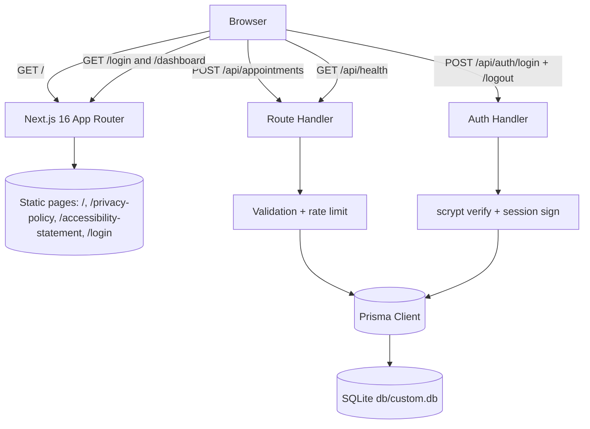

# Green Grove Family Clinic — Health Care Clinic

[](https://nextjs.org/)
[](https://react.dev/)
[](https://tailwindcss.com/)
[](https://www.typescriptlang.org/)
[](https://www.prisma.io/)
[](https://playwright.dev/)

A production-grade, pixel-faithful clone of the [Green Grove Family Clinic
landing experience](https://health-care-clinic.base44.app/), rebuilt as a
full Next.js application: the same section-for-section scroll narrative, the
same design system, and a real appointment-request backend (validated API +
SQLite via Prisma) instead of the original's hosted form sink.

## Overview

The reference app is a single-page marketing site for a family clinic:
video hero, service catalog, team, insurance partners, an appointment
request form, FAQ, and two legal pages. This rebuild reproduces it
section-for-section — identical copy, layout classes, and computed
rendering — while upgrading the substrate from a Vite SPA compiled with
Tailwind CSS v3 to **Next.js 16 App Router with Tailwind CSS v4**.

That engine migration is the interesting part: Tailwind v4 changes the
compiled output of dozens of utilities (theme token format, shadow scale,
gradient interpolation, the `space-y` selector, the `!important` modifier
syntax). Every one of those differences was measured against the live
reference and neutralized — see
[docs/Tailwind-V4-Validation-Report.md](docs/Tailwind-V4-Validation-Report.md)
and the ADR log in
[Project_Architecture_Document.md](Project_Architecture_Document.md).
The result renders at the same computed metrics as the reference (page
height 7490px at 1440×900, identical heading scales, identical card
geometry).

## Key Features

| Feature | Description |
| ------- | ----------- |
| 🎥 Video hero | Autoplaying muted looping hero video with an sRGB readability scrim and a rotating three-message value badge |
| 🧭 Scroll-spy nav | Desktop pill nav marks the section in view (mid-viewport threshold) with a persistent underline + semibold |
| 📱 Mobile menu | Accessible dropdown panel (`aria-expanded`, Escape, outside-click, link-activation closes + jumps) pinned by e2e specs |
| 🩺 Eight services | Stacked-entrance cards choreographed by IntersectionObserver + CSS custom properties |
| 📝 Appointment form | Underline-style form → validated `POST /api/appointments` → Prisma/SQLite, with Sending…/success/error states |
| ❓ FAQ accordion | Native `<details>`/`<summary>` with rotating plus glyphs |
| ⚖️ Legal pages | `/privacy-policy` and `/accessibility-statement` with identical copy and layout |
| 🔐 Staff sign-in | `/login` — scrypt password verify + HMAC-signed httpOnly session cookie (7 days), login-rate-limited |
| 📊 Appointment dashboard | `/dashboard` — staff-only review surface: stats cards (total / new today / upcoming / top specialty) + latest 100 requests, server-guarded |
| 🛡️ Abuse controls | Per-key fixed-window rate limiting (5 / 10 min on appointments, 10 / 10 min on login — keyed on the LAST `X-Forwarded-For` token so proxies make it trustworthy), a 64 KiB body cap (413) enforced while STREAM-READING (chunked bodies without content-length are capped identically), and strict server-side payload validation |
| ✅ Tested | 76 unit tests + 37 Playwright e2e tests, including Tailwind v4 trap guards, title-deviation pins, a dependency-contract pin, the full auth loop, rate-limit/429/413 pins (stream-read body cap incl. chunked transports), non-object-body tolerance pins, reduced-motion scroll pins, and the validation + timing-equalization seams |

> The reference app itself has no login or dashboard (its complete route
> table is `/`, `/privacy-policy`, `/accessibility-statement` — verified
> against its SPA bundle). The staff sign-in and appointment dashboard are
> an intentional, documented **extension beyond the reference**: they close
> the product loop the reference outsources (public form → validated API →
> SQLite persistence → staff review). Neither route is linked from the
> landing page, so the public experience stays byte-faithful.

## Architecture

| Layer | Technology | Version | Purpose |
| ----- | ---------- | ------- | ------- |
| Web framework | Next.js (App Router, standalone output) | 16.x | Pages, API routes, RSC composition |
| UI runtime | React | 19.x | Server + client components |
| Language | TypeScript (strict) | 5.x | Types throughout |
| Styling | Tailwind CSS (CSS-first `@theme inline`) | 4.x | Design tokens, utilities |
| Icons | lucide-react | 0.525.x | All iconography |
| Database | SQLite via Prisma ORM | 6.x | Appointment + staff persistence |
| Auth | Node crypto (scrypt + HMAC-SHA256) | built-in | Staff sessions — zero external auth dependencies |
| Unit tests | Vitest | 5.x | Pure seams (db-path resolution, auth crypto) |
| E2E tests | Playwright | 1.x | Landing, mobile nav, form, legal pages, auth loop |



## File Hierarchy

```
📂 src/
├── 📂 app/
│   ├── 📄 globals.css            ← Tailwind v4 theme: full hsl() tokens, pinned shadows, base element rules
│   ├── 📄 layout.tsx             ← DM Sans via next/font, metadata, viewport
│   ├── 📄 page.tsx               ← Landing composition (9 sections)
│   ├── 📂 api/appointments/      ← POST — validated writes
│   ├── 📂 api/auth/              ← POST login/logout — scrypt verify + session cookie
│   ├── 📂 api/health/            ← GET — liveness + DB probe
│   ├── 📂 login/                 ← Staff sign-in page (not linked from the landing page)
│   ├── 📂 dashboard/             ← Staff appointment dashboard (session-guarded RSC)
│   ├── 📂 privacy-policy/        ← Legal page
│   └── 📂 accessibility-statement/
├── 📂 components/site/           ← Header, Hero, About, Services, Differentiators,
│                                   Insurance, Team, Contact, AppointmentForm, Faq,
│                                   Footer, LegalPage, Reveal
├── 📂 components/dashboard/      ← LoginForm, LogoutButton (client islands)
└── 📂 lib/
    ├── 📄 content.ts             ← All site copy + icon maps (single source)
    ├── 📄 auth.ts                ← scrypt + HMAC session primitives (unit-tested)
    ├── 📄 db.ts                  ← Prisma singleton (env-resolved URL)
    └── 📄 db-path.ts             ← SQLite path resolution (unit-tested)
📂 prisma/schema.prisma           ← Appointment + AdminUser models
📂 scripts/seed.ts                ← db:seed — staff account upsert
📂 tests/e2e/                     ← Playwright specs (mobile-navigation, landing,
│                                   appointment-form, legal-pages, auth)
📂 public/media/                  ← Hero video/poster, section photography
📂 docs/                          ← Validation report, screenshots, deployment
```

## Quick Start

Requires Node.js ≥ 20 (or Bun ≥ 1.1) and a C-compatible toolchain for
Prisma's SQLite engine.

```bash
bun install                # or npm install
cp .env.example .env       # defaults: SQLite at db/custom.db
bun run db:push            # create the schema
bun run db:seed            # create the staff login (ADMIN_EMAIL/PASSWORD)
bun run dev                # http://localhost:3000
```

Verify setup:

```bash
curl http://localhost:3000/api/health
# {"ok":true,"database":"up"}
```

Staff sign-in: open `http://localhost:3000/login` and use the
`ADMIN_EMAIL` / `ADMIN_PASSWORD` from your `.env` (dotenv gotcha: a value
starting with `$` must be escaped as `\$`).

### Appointment API

| Endpoint | Method | Body / Response | Notes |
| -------- | ------ | --------------- | ----- |
| `/api/appointments` | POST | `{fullName, phone, email?, specialty, preferredDate?}` → `201 {ok, id}` | 422 with field map on invalid input (non-object bodies get the same field map); 413 over 64 KiB (stream-read cap); 429 when rate-limited (5 req / 10 min / IP) |
| `/api/health` | GET | `200 {ok, database}` | 503 when the DB is unreachable |
| `/api/auth/login` | POST | `{email, password}` → `200 {ok}` + httpOnly session cookie | 401 generic error (no user enumeration); 422 field map; 429 rate-limited (10 / 10 min / IP) |
| `/api/auth/logout` | POST | → `200 {ok}` | Clears the session cookie; idempotent |

## Environment Variables

```bash
DATABASE_URL="file:../db/custom.db"   # relative to prisma/schema.prisma
NEXT_PUBLIC_SITE_URL=http://localhost:3000   # canonical origin for metadata
AUTH_SECRET=""                        # HMAC key for staff sessions (REQUIRED in production)
ADMIN_EMAIL="admin@example.com"       # seeded by bun run db:seed
ADMIN_PASSWORD="change-me"            # seeded by bun run db:seed (escape $ as \$)
```

The `dev` / `build` / `db:*` scripts strip any ambient `DATABASE_URL`
(`env -u`) so a stray exported shell variable can never shadow the repo
`.env`; the production `start` script deliberately keeps ambient env
(see [docs/DEPLOYMENT.md](docs/DEPLOYMENT.md)).

## Testing

```bash
bun run lint          # ESLint (flat config)
bun run typecheck     # tsc --noEmit (true strict)
bun run test          # Vitest unit layer (db-path + auth + deps + validation + rate-limit seams)
bun run build         # production standalone build (types enforced)
bun run test:e2e      # Playwright — boots the standalone server + scratch DB
```

The e2e layer deserves a note: `tests/e2e/mobile-navigation.spec.ts` pins
the mobile menu contract AND guards the documented Tailwind v4 traps by
rasterizing the rendered pixel of the nav pill and dropdown (a bare-HSL
theme regression would collapse them to transparent).

## Design System

| Token | Value | Usage |
| ----- | ----- | ----- |
| `--background` | `hsl(205 50% 96%)` | Page background |
| `--foreground` / `--primary` | `hsl(151 32% 22%)` | Deep clinic green (text, buttons) |
| `--primary-foreground` | `hsl(50 58% 88%)` | Warm sand on primary |
| `--secondary` | `hsl(49 62% 82%)` | Footer tan |
| `--accent` | `hsl(205 42% 91%)` | About card right rail, team cards |
| `--service-gradient-*` | cream → blush → gold | Services + team bands (sRGB interpolation) |
| `--radius` | `1.25rem` | Base radius (cards use `rounded-[24px]`/`[28px]`) |
| `--shadow-sm` | `0 1px 2px 0 rgb(0 0 0 / 0.05)` | Pinned to the v3 geometry (v4 scale-shift guard) |

Typography: **DM Sans** (400/500/600/700) via `next/font`. Headings are
forced to weight 400 and fixed scales (h2 48px → 60px at `sm+`, h3 20px)
by the ported base layer — matching the reference exactly.

## Screenshots

| View | File |
| ---- | ---- |
| Desktop hero | [docs/screenshots/01-desktop-hero.png](docs/screenshots/01-desktop-hero.png) |
| Desktop sections | [docs/screenshots/02-desktop-*.png](docs/screenshots/) |
| Full page | [docs/screenshots/03-desktop-full.png](docs/screenshots/03-desktop-full.png) |
| Mobile hero / menu | [docs/screenshots/04-mobile-hero.png](docs/screenshots/04-mobile-hero.png), [05-mobile-menu-open.png](docs/screenshots/05-mobile-menu-open.png) |
| Appointment flow | [docs/screenshots/09-appointment-form.png](docs/screenshots/09-appointment-form.png), [10-appointment-success.png](docs/screenshots/10-appointment-success.png), [14-appointment-field-errors.png](docs/screenshots/14-appointment-field-errors.png) |
| Legal pages | [docs/screenshots/07-privacy-policy.png](docs/screenshots/07-privacy-policy.png), [08-accessibility-statement.png](docs/screenshots/08-accessibility-statement.png) |
| Staff sign-in | [docs/screenshots/11-login-desktop.png](docs/screenshots/11-login-desktop.png) |
| Appointment dashboard | [docs/screenshots/12-dashboard-desktop.png](docs/screenshots/12-dashboard-desktop.png), [13-dashboard-mobile.png](docs/screenshots/13-dashboard-mobile.png), [15-dashboard-mobile-390-full.png](docs/screenshots/15-dashboard-mobile-390-full.png) |

## Deployment

The app builds to a self-contained standalone server. See
[docs/DEPLOYMENT.md](docs/DEPLOYMENT.md) for the full runbook; the short
version:

```bash
bun run build
bun .next/standalone/server.js   # PORT + DATABASE_URL from the environment
```

## Troubleshooting

| Issue | Cause | Fix |
| ----- | ----- | --- |
| Nav pill / mobile menu renders transparent | Bare HSL triplet in `@theme inline` (v4 trap #1) | Keep full `hsl(...)` values in `:root` |
| Unhydrated page when opened via `127.0.0.1` | Next 16 dev-origin protection | `allowedDevOrigins` is set in `next.config.ts` — keep it |
| `space-y-*` gaps differ from the reference | v4 `:where()` selector rewrite (trap #4) | Prefer grid/flex gaps, or pad children directly |
| e2e color assertions fail on format | v4 computes opacity modifiers as `oklab(...)` | Rasterize pixels (see mobile-navigation spec), don't string-match |
| Data lands in the wrong `custom.db` | An ambient `DATABASE_URL` env var shadows the repo `.env` | The `dev`/`build`/`db:*` scripts `env -u` it away; `start` (production) intentionally reads ambient env |
| `db:seed` says credentials are missing | dotenv interpolated a leading `$` in the password to `""` | Escape it in `.env`: `ADMIN_PASSWORD="\$Abcd1234"` |
